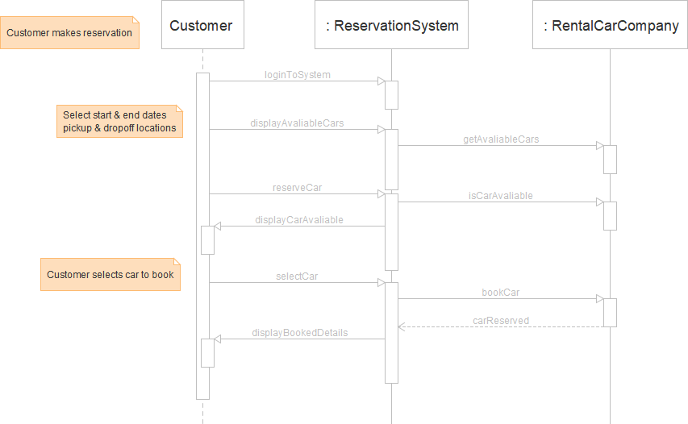
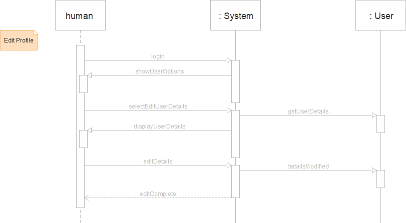

# Adam Corbin COP 5330 - 002

# 2.1
## a. Use cases
### Clear messages from someone
1. Caller dials main number of voice mail system
1. System speaks prompt "Enter mailbox number followed by #"
1. User types extension number
1. Voice mail will request if owner wants to delete messages from a specific number(along with other options)
1. System owner will acknowledge to delete messages from a specific number
1. Voice mail will request for user to enter in phone number to delete messages
1. System owner enters in phone number
1. Voice mail will delete messages where phone number matches
1. Voice mail speaks  "The messages have been successfully deleted".
1. The voice mail will close

#### Variation 1
1.1. In step 6, Voice mail doesnt find number and speaks "Number not found"

1.2. The voice mail will close

## b. Sequence diagram
### Success on deleting messages

### Failure on deleting messages


# 2.2
## Class diagram key

## Class diagrams
```mermaid
classDiagram

class CreditAccount
CreditAccount : +creditCard: CreditCard
CreditAccount : +getCreditCard()
CreditAccount : +getInterestRate(): double 
CreditAccount : +interestRate: double 

class CreditCard
CreditCard: +number: int 

CreditAccount "1" o-- "1" CreditCard

class SavingsAccount
SavingsAccount : +getInterestRate(): double
SavingsAccount : +interestRate: double

class CheckingAccount

class Account
Account <|-- CreditAccount : Inheritance
Account <|-- SavingsAccount : Inheritance
Account <|-- CheckingAccount : Inheritance
Account : +id: int
Account : +balance: double
Account : +getBalance(): double
Account : +withdraw(amount: double)
Account : +deposit(amount: double)

class Bank
Bank : +customers: HashMap<int,Customer> 
Bank o-- "0..*" Customer

class Address
Address: +streetAddress: String
Address: +getAddress(): String 


class Customer
Customer: +id: Int
Customer: +name: String
Customer : +accounts: HashMap<int,Account> 
Customer: +transfer(fromAccountID: int, toAccountID: int, amount: double)
Customer o-- "1" Address 

```

# 2.3
## a - CRC cards
1. Car
    - Responsibilities
        - The item that will be reserved in the system
    - Collaborators
        - Rental car company owns the cars
        - Reservation system keeps track of the cars
        - Customer will use this asset
2. Reservation System
    - Responsibilities
        - Used to find available cars based on the Customers needs
        - Will coordinate between the Rental Car Company and the Customer on a booking
        - User accounts
    - Collaborators
        - Customer
        - Rental Car Company
3. Customer
    - Responsibilities
        - requesting car
    - Collaborators
        - Reservation System
4. Rental Car Company
    - Responsibilities
        - Providing available cars
    - Collaborators
        - Reservation System
        - Car
## Class diagram key

## b - UML Class Diagram
```mermaid
classDiagram
class Car
Car: +carID: int
Car: +make: String 
Car: +model: String 
Car: +numberOfDoors: int 
Car: +type: String 
Car: +getCarDetails()

class ReservationSystem
ReservationSystem: +loginToSystem(username: String, passcode: String)
ReservationSystem: +reserveCar(carID: int, rentalCarCompany: String , userDetails: Customer)
ReservationSystem: +selectCar(carID: int , rentalCarCompany: String)
ReservationSystem: +displayAvaliableCars(startDate: Date, endDate: Date, pickupLocation: Address, dropoffLocation: Address)
ReservationSystem: +displayReservations()

class Customer
Customer: +getUserDetails()
Customer: +name: String
Customer: +address: String
Customer: +age: int

class RentalCarCompany
RentalCarCompany: +name: String
RentalCarCompany: +reservations: HashMap<int,Reservation>
RentalCarCompany: +getAvaliableCars(startDate: Date, endDate: Date, pickupLocation: Address, dropoffLocation: Address)
RentalCarCompany: +isCarAvaliable(carID: int)
RentalCarCompany: +bookCar(carID: int )

class Reservation
Reservation: +id: Int
Reservation: +carID: int
Reservation: +userDetails: Customer
Reservation: +startDate: Date
Reservation: +endDate: Date

RentalCarCompany o-- "1..*" Car

ReservationSystem --> "1..*" RentalCarCompany

ReservationSystem --> "0..*" Customer

RentalCarCompany o--"0..*" Reservation

```

## c - Sequence Diagram
### Customer makes a reservation



## d - State Diagram


# 2.4
## CRC cards
1. UPCScanner
    - Responsibilities
        - scan products
    - Collaborators
        - CashRegister
        - Cashier
        
2. Product
    - Responsibilities
        - just storing its own info 
    - Collaborators
        - None

3. CashRegister
    - Responsibilities
        - Display last scanned item
        - Set system into payment mode
        - Display all items with their price and total price
        - pay bill
        - print receipt
    - Collaborators
        - Cashier
        - UPCScanner
4. Inventory
    - Responsibilities
        - storing all the products the store carries 
    - Collaborators
        - CashRegister
    
## Class diagram key

## UML
    
```mermaid
classDiagram

class CashRegister
CashRegister: +inventory : ArrayList<Product>
CashRegister: +checkedOutItems : ArrayList<Product>
CashRegister: +displayLastScannedItem()
CashRegister: +payBill(money: double)
CashRegister: +displayTotal()
CashRegister: +displayAllItems()
CashRegister: +printReceipt()

class UPCScanner
UPCScanner: +scanProduct()

class Product
Product: +upc: int
Product: +name: String
Product: +price: double

CashRegister o-- "0..*" Product

CashRegister --> UPCScanner
UPCScanner --> Product

```

## Code    

### q4
```java
import java.util.Scanner;

class q4 {
    /**
     * This main method ask the user if they want to pay or scan an item
     * If the user incorrectly enters in an selection, it will ask the user to retry
     * @param args
     */
    public static void main(String[] args) {
        CashRegister cashRegister = new CashRegister();

        System.out.println("Welcome to the Store.");
        System.out.println("Press 1  - to scan an item");
        System.out.println("Press 2  - to pay");
        Scanner sc = new Scanner(System.in);
        while(true){
            String input = sc.nextLine();
            if(input.equals("1")){
                cashRegister.scanItem();
            }
            else if(input.equals("2")){
                if(cashRegister.getTotal() > 0.0) {
                    cashRegister.displayTotal();
                    cashRegister.displayAllItems();
                    while (true) {
                        try {
                            System.out.println("Enter payment");
                            input = sc.nextLine();
                            double cash = Double.parseDouble(input);
                            if (cashRegister.payBill(cash)) {
                                break;
                            }
                        } catch (Exception e) {
                            System.out.println("ERROR: Parsing double error. Please enter in valid double");
                        }
                    }

                    break;
                }else {
                    System.out.println("You dont have any items to checkout");
                }
            }else{
                System.out.println("Incorrect entry.");
            }
            System.out.println("Press 1  - to scan an item");
            System.out.println("Press 2  - to pay");
        }
    }
}
```

### CashRegister
```java
import java.util.ArrayList;

/**
 * The Cash Register has access to the UPCScanner
 */
class CashRegister{
    ArrayList<Product> checkedOutItems = new ArrayList<>();
    ArrayList<Product> inventory = new ArrayList<>();
    UPCScanner upcScanner = new UPCScanner();
    public CashRegister(){
        inventory.add(new Product(123,"Candy", 5.99));
        inventory.add(new Product(111,"Apple", 2.99));
        inventory.add(new Product(222,"Water", 1.99));
    }

    /**
     * This method will use the scanner to scan the object and look for the UPC in the inventory.
     * It will notify the user if the UPC was not found in the inventory
     * If the item was found, then it will display it to the screen
     */
    public void scanItem(){
        int newItem = upcScanner.scanProduct();
        boolean found = false;
        for(Product item : inventory){
            if(item.upc == newItem){
                checkedOutItems.add(item);
                displayLastScannedItem(item);
                found = true;
            }
        }

        if(!found){
            System.out.println("Item " + newItem + " not found");
        }

    }

    /**
     * @return total price of checked out items
     */
    public double getTotal(){
        double total = 0.0;
        for(Product product : this.checkedOutItems){
            total += product.price;
        }
        return total;
    }


    /**
     * This method will validate if the customer provided enough cash to pay the bill.
     * @param cash input amount from the customer
     * @return true == enough cash, false == short on cash
     */
    public boolean payBill(double cash){
        if(getTotal() > cash){
            System.out.println("Not enough cash. You provided " + cash + " where the balance was " + getTotal());
            return false;
        }
        else{
            double remainingBalance = cash - getTotal();
            printReceipt();
            System.out.println("Balance paid! Returning change: " + String.format("%3.2f", remainingBalance));
            return true;
        }
    }

    /**
     * @param product the item to display to the screen
     */
    public void displayLastScannedItem(Product product){
        System.out.println(product);
    }

    /**
     * Displays the total of the checked out items to the screen
     */
    public void displayTotal(){
        System.out.println("Total: " + String.format("%3.2f", getTotal()));
    }

    /**
     * Displays all the checked out items ot the screen
     */
    public void displayAllItems(){
        System.out.println("UPC\tItem\tPrice");
        for(Product product: checkedOutItems){
            System.out.println(product);
        }
    }

    /**
     * Displays all the items, total and that the bill has been paid
     */
    public void printReceipt(){
        System.out.println("--------------");
        displayAllItems();
        displayTotal();
        System.out.println("Paid!");
    }
}
```

### Product
```java
/**
 * The product class holds information related to the product
 */
class Product{
    public Integer upc = 0;
    public String name = "";
    public Double price = 0.0;

    public Product(Integer upc, String name, Double price){
        this.upc = upc;
        this.name = name;
        this.price = price;
    }

    /**
     * @return formatted string to display a product
     */
    public String toString(){
        return upc.toString() + "\t" + name + "\t$" + String.format("%3.2f", price);
    }

}
```

### UPCScanner
```java
import java.util.Scanner;

class UPCScanner{
    public UPCScanner(){
    }

    /**
     * The method is used to capture the scanned UPC
     * @return UPC from user input
     * Exception: The scanner will keep trying if the user enters in an invalid integer
     */
    public int scanProduct(){
        while(true) {
            try {
                System.out.print("Item UPC: ");
                Scanner sc = new Scanner(System.in);
                return Integer.parseInt(sc.nextLine());

            } catch (Exception e) {
                System.out.println("ERROR: Parsing int error. Please enter in valid int for the UPC");
            }
        }
    }
}
```

# 2.5
## a - Use Cases
### Read Recent Posts
1. User logs into the system
1. System will display choices to edit profile, read posts, write new posts.
1. User will select read post
1. System will display all unread posts
1. User will acknowledge posts read

### Edit Profile
1. User logs into the system
1. System will display choices to edit profile, read posts, write new posts.
1. User will select to want to edit profile
1. System will provide all items that can be edited
1. User will select and edit the items that need to be changed
1. System will take the modifications and update the User profile
1. System will acknowledge user that this has been complete.

### Write Post
1. User logs into the system
1. System will display choices to edit profile, read posts, write new posts.
1. User will select to write a post
1. System will display an dialog to enter in text for the new post
1. User will enter in text and submit new post
1. System will receive the new post and store it in the server

## b - CRC cards
1. System
    - Responsibilities
        - Manage & display posts posts
        - Manage User accounts
        - Logging into accounts
        - Connections between users
    - Collaborators
        - Post
        - User
    
2. User
    - Responsibilities
        - Contain user info
        - Keep track of read posts
    - Collaborators
        - Post
3. Post
    - Responsibilities
        - Contain post text
    - Collaborators
        - Human creating post(no class needed)

## Class diagram key

## c - UML Class Diagrams

```mermaid
classDiagram

class System
System: +loggedInUserID: int 
System: +createPost(post: Post)
System: +posts: ArrayList<Post> 
System: +users: HashMap<int,User> 
System: +connections: HashMap<int,int> 

System: +editDetails(name: String, currentJob: String, pastJobs: ArrayList<String>, education: ArrayList<String>)
System: +login(username: String , password: String)
System: +selectEditUserDetailsPage()
System: +selectCreateNewPostPage()
System: +selectViewFeed()
System: +getConnectionsPost(userID: int): ArrayList<Post>


class User
User: +id: int
User: +name: String 
User: +currentJob: String 
User: +pastJobs: ArrayList<String> 
User: +education: ArrayList<String>
User: +readPostIds: HashMap<Int,bool>
User: +getUserDetails()
User: +markPostRead(postID: int)


class Post
Post: +id: int
Post: +userOwner: int 
Post: +text: String 

System --> "0..*" User
System --> "0..*" Post
User -- Post
User --> "0..*" User : friend connections

```

## d - UML Sequence Diagrams
### Read Recent Posts


### Edit Profile


### Write Post
