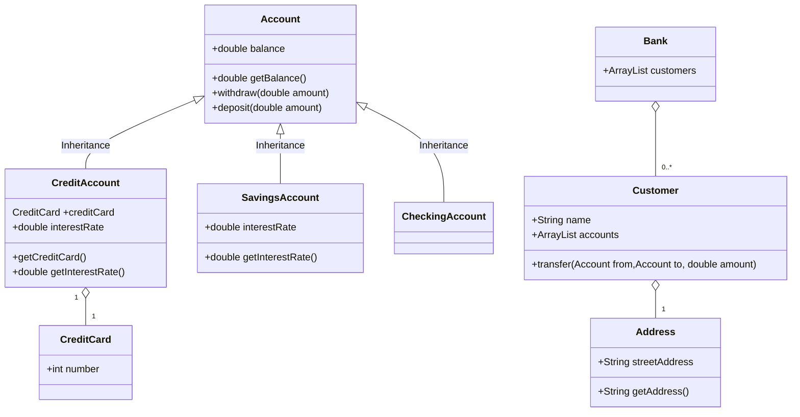

# 2.2
## Class diagrams

```mermaid
classDiagram

class CreditAccount
CreditAccount : CreditCard +creditCard
CreditAccount : +getCreditCard()
CreditAccount : +double getInterestRate()
CreditAccount : +double interestRate

class CreditCard
CreditCard: +int number

CreditAccount "1" o-- "1" CreditCard

class SavingsAccount
SavingsAccount : +double getInterestRate()
SavingsAccount : +double interestRate

class CheckingAccount

class Account
Account <|-- CreditAccount : Inheritance
Account <|-- SavingsAccount : Inheritance
Account <|-- CheckingAccount : Inheritance
Account : +double balance
Account : +double getBalance()
Account : +withdraw(double amount)
Account : +deposit(double amount)

class Bank
Bank : +ArrayList<Customer> customers
Bank o-- "0..*" Customer

class Address
Address: +String streetAddress
Address: +String getAddress()


class Customer
Customer: +String name
Customer : +ArrayList<Account> accounts
Customer: +transfer(Account from,Account to, double amount)
Customer o-- "1" Address 


```

