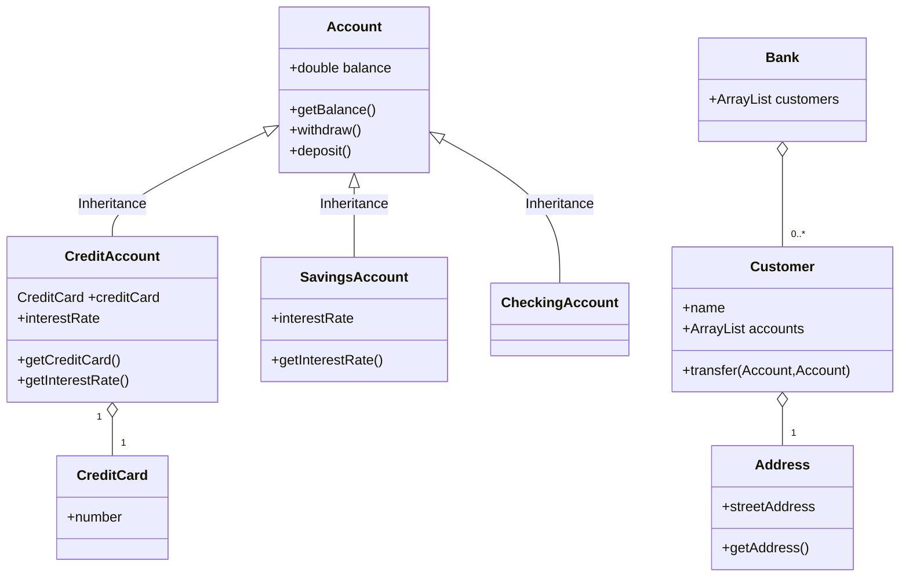

# 2.2
## Class diagrams

```mermaid
classDiagram

class CreditAccount
CreditAccount : CreditCard +creditCard
CreditAccount : +getCreditCard()
CreditAccount : +getInterestRate()
CreditAccount : +interestRate

class CreditCard
CreditCard: +number

CreditAccount "1" o-- "1" CreditCard

class SavingsAccount
SavingsAccount : +getInterestRate()
SavingsAccount : +interestRate

class CheckingAccount

class Account
Account <|-- CreditAccount : Inheritance
Account <|-- SavingsAccount : Inheritance
Account <|-- CheckingAccount : Inheritance
Account : +double balance
Account : +getBalance()
Account : +withdraw()
Account : +deposit()

class Bank
Bank : +ArrayList<Customer> customers
Bank o-- "0..*" Customer

class Address
Address: +streetAddress
Address: +getAddress()


class Customer
Customer: +name
Customer : +ArrayList<Account> accounts
Customer: +transfer(Account,Account)
Customer o-- "1" Address 


```

