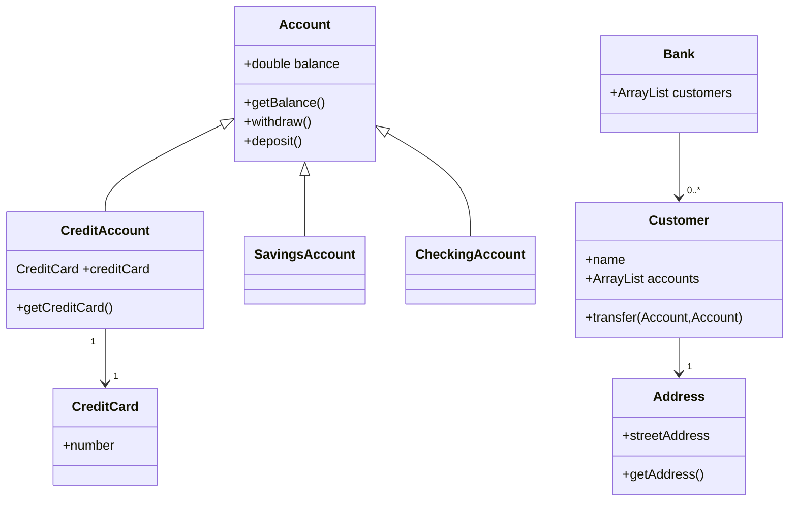

# 2.2
## Class diagrams

```mermaid
classDiagram

class CreditAccount
CreditAccount : CreditCard +creditCard
CreditAccount : +getCreditCard()

class CreditCard
CreditCard: +number

CreditAccount "1" --> "1" CreditCard

class SavingsAccount

class CheckingAccount

class Account
Account <|-- CreditAccount
Account <|-- SavingsAccount
Account <|-- CheckingAccount
Account : +double balance
Account : +getBalance()
Account : +withdraw()
Account : +deposit()

class Bank
Bank : +ArrayList<Customer> customers
Bank --> "0..*" Customer

class Address
Address: +streetAddress
Address: +getAddress()


class Customer
Customer: +name
Customer : +ArrayList<Account> accounts
Customer: +transfer(Account,Account)
Customer --> "1" Address 


```

