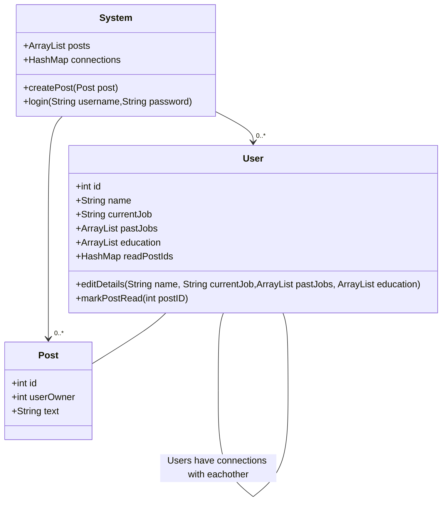

#q5
## a - Use Cases
### Read Recent Posts
1. User logs into the system
1. System will display choices to edit profile, read posts, write new posts.
1. User will select read post
1. System will display all unread posts
1. User will acknowledge posts read

### Edit Profile
1. User logs into the system
1. System will display choices to edit profile, read posts, write new posts.
1. User will select to want to edit profile
1. System will provide all items that can be edited
1. User will select and edit the items that need to be changed
1. System will take the modifications and update the User profile

### Write Post
1. User logs into the system
1. System will display choices to edit profile, read posts, write new posts.
1. User will select to write a post
1. System will display an dialog to enter in text for the new post
1. User will enter in text and submit new post
1. System will receive the new post and store it in the server

## b - CRC cards
1. System
    - Responsibilities
        - Manage & display posts posts
        - Manage User accounts
        - Logging into accounts
    - Collaborators
        - Post
        - User
    
2. User
    - Responsibilities
        - Contain user info
        - Keep track of read posts
        - Connections between users
    - Collaborators
        - Post
3. Post
    - Responsibilities
        - Contain post text
    - Collaborators

## c - UML Class Diagrams

## d - UML Sequence Diagrams
### Read Recent Posts
```sequence
Title: Read Recent Posts
User --> System : 
```

### Edit Profile
```sequence
Title: Edit Profile
```

### Write Post
```sequence
Title: Write Post
```