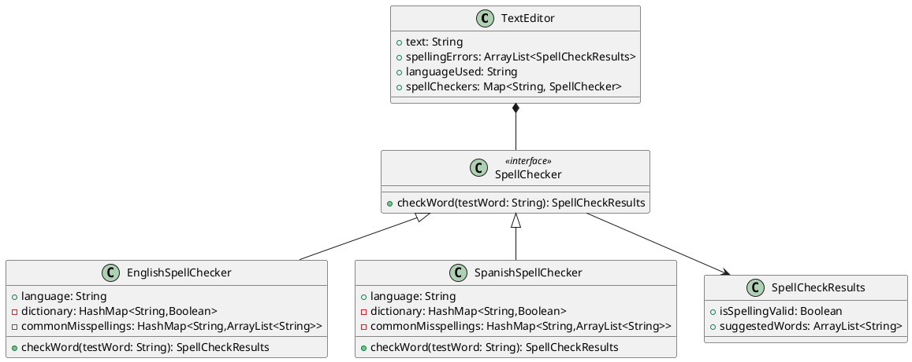
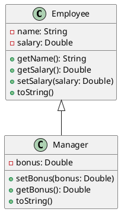

# q5.1
## a
a) What is the purpose of a design pattern ?

### a answer
The purpose of a design pattern is to organize a set of behaviours in a way that the program can be easily maintained
and easy to understand, and easy to expand on new behaviors or features.

## b
b) When do you apply the Observer pattern ?

### b answer
An observer pattern is used extensively when developing UI applications. For example when there is a button and the program
wants to do an action when the button is pressed using an ActionListener this would use the Observer pattern.

## c 
c) You review a design written by somebody else for an application
and you find these:

  - an interface Shape with a method draw()
  - a class Circle that implements Shape
  - a class Rectangle that implements Shape
  - a class CompoundShape that:
       o  implements interface Shape
       o  aggregates 0 or more Shape objects, 
       o  has an extra method called add(Shape sh)
       o  for implementing method draw() calls the draw() method for all
          aggregated Shape objects.
    You assume that a CompoundShape object is made of multiple shapes.
What design pattern is at work in this application? Explain your answer.

### c answer
This is using a Strategy pattern because we have a base class called Shape where the other classes Circle, Rectangle, 
and CompoundShape are inheriting the draw method interface, but each class will individually have different implementations
within that draw routine.

We also see a Composite pattern in the CompoundShape where it holds multiple shapes and calls the children's draw routine.
 
## d
d) The TitledBorder class can give a title to a border. Consider the code

    panel.setBorder(new TitledBorder(new EtchedBorder(), "Enter Option"));

What design pattern(s) are at work? Explain your answer.
(a similar example is in the textbook/notes)

### d answer
This is a decorator pattern because we are setting up a not only a Titled boarder, but a special kind using the EtchedBoarder class
It would be possible to just use the TitledBoarder class which remain undecorated.

# q5.1
Suppose you have to design a text editor class (TextEditor) that should 
benefit from multiple variants of a spell cheking algorithm. Users of the 
TextEditor class would have to supply custom versions of the spell cheking 
algorithm to support spelling in different languages. 

## a
a) What design pattern would you use and why ?

We would want to use the strategy because we could define a core set of interfaces and have different underlying
implementations to accomplish the goal for each language.

## b 
b) Write the UML class diagram for the design pattern as it applies to this problem.



## c
c) Write a table that lists the relationship between the names from the 
identified design pattern and the classes/interfaces from your problem.

### Strategy design pattern
|Name in Design Pattern| Actual Name|
|---|---|
|Strategy|SpellChecker|
|ConcreteStrategy|EnglishSpellChecker|
|ConcreteStrategy|SpanishSpellChecker|
|doWork()|checkWord is the interface to the SpellChecker |


## d
d) Write the skeleton Java code for the design: definitions for classes with instance 
variables and methods as detailed as we can from the problem description. 

### EnglishSpellChecker.java
```java
import java.util.ArrayList;
import java.util.HashMap;
/**
 * This class will handle the English version of a spell checker.
 * In general the test word will be checked if it lives in the Dictionary. If not
 * we have a misspelling in where we will keep track of a common misspellings. If not
 * in either then the results will be invalid spelling and no suggestions
 */
public class EnglishSpellChecker implements SpellChecker  {

    String language;
    HashMap<String,Boolean> dictionary = new HashMap();
    HashMap<String, ArrayList<String>> commonMisspellings = new HashMap();
    EnglishSpellChecker(String language){
        this.language = language;
    }

    @Override
    public SpellCheckerResults checkWord(String testWord) {

        if(this.dictionary.containsKey(testWord)){
            return new SpellCheckerResults(true,new ArrayList());
        }
        else if(this.commonMisspellings.containsKey(testWord)){
            return new SpellCheckerResults(false,this.commonMisspellings.get(testWord));
        }else{
            return new SpellCheckerResults(false,new ArrayList());
        }
    }
}

```
### SpanishSpellChecker.java
```java
import java.util.ArrayList;
import java.util.HashMap;

/**
 * This class will handle the Spanish version of a spell checker.
 * In general the test word will be checked if it lives in the Dictionary. If not
 * we have a misspelling in where we will keep track of a common misspellings. If not
 * in either then the results will be invalid spelling and no suggestions
 */
public class SpanishSpellChecker implements SpellChecker {

    String language;
    HashMap<String,Boolean> dictionary = new HashMap();
    HashMap<String, ArrayList<String>> commonMisspellings = new HashMap();
    SpanishSpellChecker(String language){
        this.language = language;
    }
    @Override
    public SpellCheckerResults checkWord(String testWord) {
        if(this.dictionary.containsKey(testWord)){
            return new SpellCheckerResults(true,new ArrayList());
        }
        else if(this.commonMisspellings.containsKey(testWord)){
            return new SpellCheckerResults(false,this.commonMisspellings.get(testWord));
        }else{
            return new SpellCheckerResults(false,new ArrayList());
        }
    }
}

```
### SpellChecker.java
```java
/**
 * This interfaced is designed to be a base of any kind of spellchecker. Each class that
 * implements the check word would use their own implementation of how to check if the word is spelled correctly
 */
public interface SpellChecker {
    public SpellCheckerResults checkWord(String word);
}

```
### SpellCheckerResults.java
```java
import java.util.ArrayList;

/**
 * This class is used to represent if a word is spelled correctly and if not a list of
 * suggested words that might be the correct spelling
 */
public class SpellCheckerResults {

    Boolean isValid;
    ArrayList<String> suggestedWords;

    SpellCheckerResults(Boolean isValid, ArrayList<String> suggestedWords){
        this.isValid = isValid;
        this.suggestedWords = suggestedWords;
    }
}

```
### TextEditor.java
```java
import java.util.ArrayList;
import java.util.HashMap;

public class TextEditor {
    HashMap<String,SpellChecker> spellCheckers = new HashMap<>();
    String text = "";
    ArrayList<SpellCheckerResults> SpellingErrors = new ArrayList<>();
    String languageUsed = "English";

    /**
     * This class will create 2 spell checkers where they are indexed by the english language string
     * This class would be used by using a specific spell checker by iterating over the text string
     * to check a single word
     * */
    TextEditor(){
        spellCheckers.put("English",new EnglishSpellChecker("English"));
        spellCheckers.put("Spanish",new SpanishSpellChecker("Spanish"));
    }
}
```
# q5.3
## BarIcon
```java
import javax.swing.*;
import java.awt.*;

/**
 * This class is used as way to display objects on the screen with a color.
 */
public class BarIcon implements Icon {

    int x,y,width, height;
    Color color;

    BarIcon(int x, int y, int width, int height, Color color){
        System.out.println(y );
        this.width = width;
        this.height = height;
        this.color = color;
        this.x = x;
        this.y = y;
    }

    @Override
    public void paintIcon(Component c, Graphics g, int x, int y) {
        Graphics2D g2 = (Graphics2D) g;
        Rectangle rect2 = new Rectangle(this.x,this.y,width,height);
        g2.setColor(color);
        g2.fill(rect2);
    }

    @Override
    public int getIconWidth() {
        return width;
    }

    @Override
    public int getIconHeight() {
        return height;
    }
}

```
## BarModel
```java
public class BarModel {
    int barWidth = 0;

    /**
     * This class is used to keep track of the width of the Bar
     * @param barWidth initialized value to how big the Bar should be
     */
    BarModel(int barWidth){
        this.barWidth = barWidth;
    }

    /**
     * @param updatedWidth - value to update the internal barWidth
     */
    public void updateWidth(int updatedWidth){
        this.barWidth = updatedWidth;
    }
}

```
## GUIController
```java
import javax.swing.*;
import javax.swing.border.Border;
import javax.swing.border.CompoundBorder;
import javax.swing.border.EmptyBorder;
import java.awt.*;
import java.awt.event.KeyEvent;
import java.awt.event.KeyListener;
import java.util.ArrayList;
import java.util.Random;

public class GUIController {
    /**
     * In the GUI Controller it will create 3 JTextField, and 3 BarIcons to be added to the GUIView
     * It will also create 3 BarModels which store the value of the bar height
     */
    public static void main(String[] args) {
        GUIView guiView = new GUIView();
        Random rand = new Random();
        ArrayList<BarModel> barModelArray = new ArrayList<>();
        for (int i = 0; i < 3 ; i++) {
            barModelArray.add(new BarModel(rand.nextInt(100)));
        }

        int height = 50;

        createBarRow(guiView, barModelArray.get(0), height, 1, Color.red);
        createBarRow(guiView, barModelArray.get(1), height, 2, Color.green);
        createBarRow(guiView, barModelArray.get(2), height, 3, Color.blue);

        guiView.repack();
    }

    /**
     * This function will create and add JTextFields and BarIcons to the GUIView
     * There will also have some KeyListners when the JTExtFields are edited. When that occurs
     * the BarModle will update. From that value, the BarIcon will update its width and tell the GUIView to refresh
     *
     * @param guiView  - the view to add the JTextFields and BarIcons to
     * @param barModel - the mode where the BarIcon heigths and text values are stored
     * @param height - The height of how big the BarIcons should be
     * @param index - index used to edit the holders within the GuiView
     * @param color - The color of the BarIcon should be when created
     */
    static void createBarRow(GUIView guiView, BarModel barModel, int height, int index, Color color) {
        int maxWidth = 250;
        BarIcon barIcon = new BarIcon(15,0,maxWidth,height, color);
        guiView.barIcons.add(barIcon);
        barIcon.width = (int) (barModel.barWidth/100.0 * maxWidth);
        JLabel jLabel = new JLabel(barIcon);
        JTextField textField = new JTextField(3);
        textField.setPreferredSize(new Dimension(50,50));
        Border empty = new EmptyBorder(10, 10, 10, 10);
        Border compound = new CompoundBorder(textField.getBorder(), empty);
        textField.setEnabled(true);
        textField.setBorder(compound);
        textField.setText(String.valueOf(barModel.barWidth));
        guiView.textFields.add(textField);

        final int localIndex = index - 1; // Index 0 is the label for the range 0-100
        textField.addKeyListener(new KeyListener() {
            @Override
            public void keyTyped(KeyEvent e) {

                updateBarIcon(guiView, barModel, localIndex, maxWidth);
            }

            @Override
            public void keyPressed(KeyEvent e) {
                updateBarIcon(guiView, barModel, localIndex, maxWidth);
            }

            @Override
            public void keyReleased(KeyEvent e) {
                updateBarIcon(guiView, barModel, localIndex, maxWidth);
            }
        });

        guiView.textPanel.add(textField);

        guiView.barPanel.add(jLabel);
        guiView.frame.repaint();
    }

    /**
     * This function will retrieve the text value and update the BarModel object. There is also a test to ensure that
     * the values are numeric and between 0 and 100(inclusive)
     * @param guiView - Used to find the text value within the text fields
     * @param barModel - Used to update the barWidth value
     * @param localIndex - Used to index into the correct BarIcons and TextField arrays in the GUIView
     * @param maxWidth - Used to come up with the scaled value to display on the screen. Values from 0-100 was too small
     *                 on the screen so we have a max size to compute based on the percentage of how big it should be
     */
    private static void updateBarIcon(GUIView guiView, BarModel barModel, int localIndex, int maxWidth) {
        try {
            int size = Integer.parseInt(guiView.textFields.get(localIndex).getText());
            if (0 <= size && size <= 100) {
                barModel.updateWidth(size);
                guiView.barIcons.get(localIndex).width = (int) (((double) barModel.barWidth / 100.0) * maxWidth);
                guiView.frame.repaint();
            }
        }catch (Exception e){
            System.out.println("ERROR: Parsing Int failed. Be sure to only use integers");
        }
    }
}

```
## GUIView
```java
import javax.swing.*;
import java.awt.*;
import java.util.ArrayList;

public class GUIView {
    JFrame frame = new JFrame();
    JPanel masterPanel = new JPanel(new GridLayout(2,3));
    JPanel textPanel = new JPanel(new GridLayout(3,1));
    JPanel barPanel = new JPanel(new GridLayout(3,1));
    ArrayList<JTextField> textFields = new ArrayList();
    ArrayList<BarIcon> barIcons = new ArrayList();

    /**
     * This is the view of the MVC. It handles holding the text panel and the bar panel and laying out the pieces
     */
    GUIView(){
        JLabel label = new JLabel("Keep numbers [0,100]");
        masterPanel.add(label);
        JLabel label2 = new JLabel(""); // This is only needed because of the Grid layout
        masterPanel.add(label2);


        masterPanel.add(textPanel);
        masterPanel.add(barPanel);
        frame.add(masterPanel);
        frame.setDefaultCloseOperation(JFrame.EXIT_ON_CLOSE);
        frame.pack();
        frame.setVisible(true);
        frame.setSize(750, 400);
    }

    /**
     * After new items get added to the frame its good to repack and set the size back to default
     */
    public void repack(){
        frame.pack();
        frame.setSize(750,400);
    }
}
```

# q6.1

## a
a) Explain the purpose of abstract classes in no more than 15 lines.

An abstract class is used to create a base set of interfaces with possible instance variables. 
This is really great when you might need to create many different kinds of objects that are different 
but there is a core set of functionality that you want to retain. An Abstract Class can also have implemented
methods so the children classes dont need to reinvent the wheel. This works great in a hierarchy mapping
of many classes that might want to inherit other methods or fields from the parent class.
 
## b
b) Give an example for a situation when an abstract class cannot be used 
in a Java program and an interface is the only choice.

Java doesn't have multiple inheritance so you can only extend a class with 1 abstract class. 
However, you can implement as many interfaces as you want to a class.

## c
c) GeneralPath collects shapes and is itself a shape. What design pattern does
it implement ? Explain.

This is an instance of a composite pattern since it contains instances of children classes. 
The GeneralPath is the main container that holds multiple other shapes and as a whole is considered
one object.

# 6.2

## Template Method design pattern
|Name in Design Pattern| Actual Name|
|---|---|
|AbstractClass|Employee|
|ConcreteClass|Manager|
|templateMethod()|toString()|
|primitiveOp1()| getName(),getSalary(), setSalary()|

## UML


## Employee.java
```java
/**
 * This is the base class 
 */
public class Employee {
    private String name;
    private Double salary;

    Employee(String name){
        this.name = name;
    }

    public String getName(){
        return this.name;
    }

    public void setSalary(Double salary) {
        this.salary = salary;
    }
    public Double getSalary() {
        return salary;
    }

    /**
     * This is the template method in which any class that extends this class will inherit this toString method
     * @return
     */
    public String toString() {
        return "Employee{" +
                "name='" + this.getName() + '\'' +
                ", salary=" + this.getSalary() +
                '}';
    }
}

```
## Manager.java
```java
public class Manager extends Employee {
    private Double bonus;
    Manager(String name) {
        super(name);
    }

    public Double getBonus() {
        return bonus;
    }

    public void setBonus(Double bonus) {
        this.bonus = bonus;
    }


}
```

# q6.3

## SelectableShape.java
```java
import java.awt.*;

/**
   A shape that manages its selection state.
*/
public abstract class SelectableShape implements SceneShape
{
   public void setSelected(boolean b)
   {
      selected = b;
   }

   public boolean isSelected()
   {
      return selected;
   }

   public void drawSelection(Graphics2D g2)
   {
      //Capture the default stroke to be used to reset after the dashed objects get drawn
      g2.setColor(Color.black);
      Stroke defaultStroke = g2.getStroke();
      draw(g2);

      if(this.isSelected()){
         g2.setColor(Color.BLUE);
         float[] dash1 = { 5.0f };
         g2.setStroke(new BasicStroke(2.0f,
                 BasicStroke.CAP_BUTT, BasicStroke.JOIN_MITER, 5.0f, dash1, 0.0f));
         //Get the bounds of the object, make it a little bit larger and align up to boarder to be at the
         // bottom right corner
         Rectangle rect = this.getPath().getBounds();
         rect.height = rect.height + 5;
         rect.width = rect.width + 5;
         rect.x = rect.x - 4;
         rect.y = rect.y - 4;
         g2.draw(rect);

         //Create the 4 corners
         Rectangle rect1 = new Rectangle(rect.x-3,rect.y-3,6,6);
         g2.fill(rect1);
         Rectangle rect2 = new Rectangle(rect.x-3,rect.y-3 + rect.height,6,6);
         g2.fill(rect2);
         Rectangle rect3 = new Rectangle(rect.x-3  + rect.width,rect.y-3 + rect.height,6,6);
         g2.fill(rect3);
         Rectangle rect4 = new Rectangle(rect.x-3 + rect.width,rect.y-3,6,6);
         g2.fill(rect4);
      }

      //Reset the color and stroke back to normal. Without this you might cause subsequent objects
      // that might not be selected to use the selected color and stroke.
      g2.setColor(Color.black);
      g2.setStroke(defaultStroke);
   }

   private boolean selected;
}

```

## CarShape.java
```java
import java.awt.*;
import java.awt.geom.*;

/**
   A car shape.
*/
public class CarShape extends CompoundShape
{
   /**
      Constructs a car shape.
      @param x the left of the bounding rectangle
      @param y the top of the bounding rectangle
      @param width the width of the bounding rectangle
   */
   public CarShape(int x, int y, int width)
   {
      Rectangle2D.Double body
         = new Rectangle2D.Double(x, y + width / 6, 
            width - 1, width / 6);
      Ellipse2D.Double frontTire
         = new Ellipse2D.Double(x + width / 6, y + width / 3, 
            width / 6, width / 6);
      Ellipse2D.Double rearTire
         = new Ellipse2D.Double(x + width * 2 / 3, 
            y + width / 3,
            width / 6, width / 6);

      // The bottom of the front windshield
      Point2D.Double r1
         = new Point2D.Double(x + width / 6, y + width / 6);
      // The front of the roof
      Point2D.Double r2
         = new Point2D.Double(x + width / 3, y);
      // The rear of the roof
      Point2D.Double r3
         = new Point2D.Double(x + width * 2 / 3, y);
      // The bottom of the rear windshield
      Point2D.Double r4
         = new Point2D.Double(x + width * 5 / 6, y + width / 6);
      Line2D.Double frontWindshield
         = new Line2D.Double(r1, r2);
      Line2D.Double roofTop
         = new Line2D.Double(r2, r3);
      Line2D.Double rearWindshield
         = new Line2D.Double(r3, r4);

      add(body);
      add(frontTire);
      add(rearTire);
      add(frontWindshield);
      add(roofTop);
      add(rearWindshield);
   }
}

```

## CompoundShape.java
```java
import java.awt.*;
import java.awt.geom.*;

/**
   A scene shape that is composed of multiple geometric shapes.
*/
public abstract class CompoundShape extends SelectableShape
{
   public CompoundShape()
   {
      path = new GeneralPath();
   }

   protected void add(Shape s)
   {
      path.append(s, false);
   }

   public boolean contains(Point2D aPoint)
   {
      return path.contains(aPoint);
   }

   public void translate(int dx, int dy)
   {
      path.transform(
            AffineTransform.getTranslateInstance(dx, dy));
   }

   public Rectangle getPath(){
      return path.getBounds();
   }

   public void draw(Graphics2D g2)
   {
      g2.draw(path);
   }
   
   private GeneralPath path;
}
```

## HouseShape.java
```java
import java.awt.*;
import java.awt.geom.*;

/**
   A house shape.
*/
public class HouseShape extends CompoundShape
{
   /**
      Constructs a house shape.
      @param x the left of the bounding rectangle
      @param y the top of the bounding rectangle
      @param width the width of the bounding rectangle
   */
   public HouseShape(int x, int y, int width)
   {
      Rectangle2D.Double base 
         = new Rectangle2D.Double(x, y + width, width, width);

      // The left bottom of the roof
      Point2D.Double r1
         = new Point2D.Double(x, y + width);
      // The top of the roof
      Point2D.Double r2
         = new Point2D.Double(x + width / 2, y);
      // The right bottom of the roof
      Point2D.Double r3
         = new Point2D.Double(x + width, y + width);

      Line2D.Double roofLeft
         = new Line2D.Double(r1, r2);
      Line2D.Double roofRight
         = new Line2D.Double(r2, r3);

      add(base);
      add(roofLeft);
      add(roofRight);
   }
}

```

## SceneComponent.java
```java
import javax.swing.*;
import java.awt.*;
import java.awt.event.MouseAdapter;
import java.awt.event.MouseEvent;
import java.awt.event.MouseMotionAdapter;
import java.util.ArrayList;

/**
   A component that shows a scene composed of shapes.
*/
public class SceneComponent extends JComponent
{
   public SceneComponent()
   {
      shapes = new ArrayList<SceneShape>();

      addMouseListener(new
         MouseAdapter()
         {
            public void mousePressed(MouseEvent event)
            {
               mousePoint = event.getPoint();
               for (SceneShape s: shapes)
               {
                  if (s.contains(mousePoint))
                     s.setSelected(!s.isSelected());
               }
               repaint();
            }
         });

      addMouseMotionListener(new
         MouseMotionAdapter()
         {
            public void mouseDragged(MouseEvent event)
            {
               Point lastMousePoint = mousePoint;
               mousePoint = event.getPoint();
               for (SceneShape s : shapes)
               {
                  if (s.isSelected())
                  {
                     double dx = mousePoint.getX() - lastMousePoint.getX();
                     double dy = mousePoint.getY() - lastMousePoint.getY();
                     s.translate((int) dx, (int) dy);
                  }
               }
               repaint();
            }
         });
   }

   /**
      Adds an shape to the scene.
      @param s the shape to add
   */
   public void add(SceneShape s)
   {
      shapes.add(s);
      repaint();
   }

   /**
      Removes all selected shapes from the scene.
   */
   public void removeSelected()
   {
      for (int i = shapes.size() - 1; i >= 0; i--)
      {
         SceneShape s = shapes.get(i);
         if (s.isSelected()) shapes.remove(i);
      }
      repaint();
   }

   public void paintComponent(Graphics g)
   {
      super.paintComponent(g);
      Graphics2D g2 = (Graphics2D) g;
      for (SceneShape s : shapes)
      {
         s.draw(g2);
         if (s.isSelected())
            s.drawSelection(g2);
      }
   }

   private ArrayList<SceneShape> shapes;
   private Point mousePoint;
}

```

## SceneEditor.java
```java
import java.awt.*;
import java.awt.geom.*;
import java.awt.event.*;
import javax.swing.*;

/**
   A program that allows users to edit a scene composed
   of items.
*/
public class SceneEditor
{
   public static void main(String[] args)
   {
      JFrame frame = new JFrame();
      frame.setDefaultCloseOperation(JFrame.EXIT_ON_CLOSE);

      final SceneComponent scene = new SceneComponent();

      JButton houseButton = new JButton("House");
      houseButton.addActionListener(new
         ActionListener()
         {
            public void actionPerformed(ActionEvent event)
            {
               scene.add(new HouseShape(20, 20, 50));
            }
         });

      JButton carButton = new JButton("Car");
      carButton.addActionListener(new
         ActionListener()
         {
            public void actionPerformed(ActionEvent event)
            {
               scene.add(new CarShape(20, 20, 50));
            }
         });

      JButton removeButton = new JButton("Remove");
      removeButton.addActionListener(new
         ActionListener()
         {
            public void actionPerformed(ActionEvent event)
            {
               scene.removeSelected();
            }
         });

      JPanel buttons = new JPanel();
      buttons.add(houseButton);
      buttons.add(carButton);
      buttons.add(removeButton);

      frame.add(scene, BorderLayout.CENTER);
      frame.add(buttons, BorderLayout.NORTH);

      frame.setSize(300, 300);
      frame.setVisible(true);
   }
}


```

## SceneShape.java
```java
import java.awt.*;
import java.awt.geom.*;

/**
   A shape that is a part of a scene.
*/
public interface SceneShape
{
   /**
      Draws this item.
      @param g2 the graphics context
   */
   void draw(Graphics2D g2);
   /**
      Draws the selection adornment of this item.
      @param g2 the graphics context
   */
   void drawSelection(Graphics2D g2);
   /**
      Sets the selection state of this item.
      @param b true if this item is selected
   */
   void setSelected(boolean b);
   /**
      Gets the selection state of this item.
      @return true if this item is selected
   */
   boolean isSelected();
   /**
      Translates this item by a given amount.
      @param dx the amount to translate in x-direction
      @param dy the amount to translate in y-direction
   */
   void translate(int dx, int dy);
   /**
      Tests whether this item contains a given point.
      @param p a point
      @return true if this item contains p
   */
   boolean contains(Point2D p);

   Rectangle getPath();

}

```