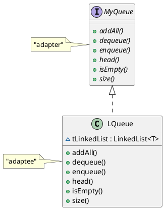

# L.1

## L.1 A)

### Functor.java

```java
public interface Functor<R,T> {
    public R apply(T param);
}
```

### LengthFun.java

```java
public class LengthFun implements Functor<Integer, String> {
    /**
     * @param param input string to get the length from
     * @return size of the input string length
     */
    @Override
    public Integer apply(String param) {
        return param.length();
    }


    public static void main(String[] args) {
        String stringTester = "138jdhafh38-fushf";
        LengthFun lengthFun = new LengthFun();
        Integer length = lengthFun.apply(stringTester);

        System.out.println("L1.a");
        System.out.println("Testing out the LengthFun");
        System.out.println(stringTester + " has length: " + length + " and is equal to stringTester.length() == " + (stringTester.length() == length));

        System.out.println("Testing out lambda version");
        Functor<Integer, String> lambda = (String s) -> {
            return s.length();
        };
        Integer lambdaLen = lambda.apply(stringTester);
        System.out.println(stringTester + " has length: " + lambdaLen + " and is equal to using LengthFun == " + (lambdaLen == length));
    }
}
```

## L.1 B)

### MyList.java

```java
import java.util.Iterator;
import java.util.LinkedList;

class MyList<T> extends LinkedList<T> {
    /**
    * run the funtor application on each element in the list
    * @param fo functor function
    * @param <R> generic type used 
    * @return new list where the function has been applied
    */
    public <R> MyList<R> map(Functor<R, T> fo) {
        MyList<R> newList = new MyList<>();
        for (T t : this) {
            newList.add(fo.apply(t));
        }
        return newList;
    }

    /**
    * the sucessive "cummulative" application of the Functor2 apply() function to all elements of the list
    * @param fo2 functor used to apply to each of the elements
    * @param initialValue starting value applied to the first item in the list
    * @return value of the successive cummulative computation
    */
    public T reduce(Functor2<T, T, T> fo2, T initialValue) {
        Iterator<T> iterable = this.iterator();
        T accumlator = initialValue;
        while(iterable.hasNext()){
            accumlator = fo2.apply(accumlator,iterable.next());
        }
        return accumlator;
    }

    public static void main(String[] args) {
        MyList<Integer> myList = new MyList<>();
        myList.add(-2);
        myList.add(1);
        myList.add(0);
        myList.add(4);

        MyList<Integer> newList = myList.map(new TimesTwoFun());

        System.out.println("L1.B");
        System.out.println("Testing MyList mapping using the TimeTwoFunction");
        System.out.println("Org list:");
        for (Integer i : myList) {
            System.out.print(i + ", ");
        }
        System.out.println("\n New list:");
        for (Integer i : newList) {
            System.out.print(i + ", ");
        }

        // lambda version
        Functor<Integer, Integer> functorTwoTimes = i -> i * 2;
        MyList<Integer> lambdaList = myList.map(functorTwoTimes);
        System.out.println("\n New list using lambda:");
        for (Integer i : lambdaList) {
            System.out.print(i + ", ");
        }

    }
}
```

### TimesTwoFun.java

```java
public class TimesTwoFun implements Functor<Integer,Integer> {
    /**
    * 
    * @param param input value used
    * @return doubling the input value
    */
    @Override
    public Integer apply(Integer param) {
        return param * 2;
    }
}
```

## L.1 C)

### Functor2.java

```java
public interface Functor2<R, T1, T2> {
    R apply(T1 param1, T2 param2);
}
```

### MyList.java

```java
import java.util.Iterator;
import java.util.LinkedList;

class MyList<T> extends LinkedList<T> {
    /**
    * run the funtor application on each element in the list
    * @param fo functor function
    * @param <R> generic type used 
    * @return new list where the function has been applied
    */
    public <R> MyList<R> map(Functor<R, T> fo) {
        MyList<R> newList = new MyList<>();
        for (T t : this) {
            newList.add(fo.apply(t));
        }
        return newList;
    }

    /**
    * the sucessive "cummulative" application of the Functor2 apply() function to all elements of the list
    * @param fo2 functor used to apply to each of the elements
    * @param initialValue starting value applied to the first item in the list
    * @return value of the successive cummulative computation
    */
    public T reduce(Functor2<T, T, T> fo2, T initialValue) {
        Iterator<T> iterable = this.iterator();
        T accumlator = initialValue;
        while(iterable.hasNext()){
            accumlator = fo2.apply(accumlator,iterable.next());
        }
        return accumlator;
    }

    public static void main(String[] args) {
        MyList<Integer> myList = new MyList<>();
        myList.add(-2);
        myList.add(1);
        myList.add(0);
        myList.add(4);

        MyList<Integer> newList = myList.map(new TimesTwoFun());

        System.out.println("L1.B");
        System.out.println("Testing MyList mapping using the TimeTwoFunction");
        System.out.println("Org list:");
        for (Integer i : myList) {
            System.out.print(i + ", ");
        }
        System.out.println("\n New list:");
        for (Integer i : newList) {
            System.out.print(i + ", ");
        }

        // lambda version
        Functor<Integer, Integer> functorTwoTimes = i -> i * 2;
        MyList<Integer> lambdaList = myList.map(functorTwoTimes);
        System.out.println("\n New list using lambda:");
        for (Integer i : lambdaList) {
            System.out.print(i + ", ");
        }

    }
}
```

### Summer.java

```java
public class Summer implements Functor2<Integer, Integer, Integer> {
    @Override
    public Integer apply(Integer param1, Integer param2) {
        return param1 + param2;
    }
}
```

### SummerTest.java

```java
public class SummerTest {
    public static void main(String[] args) {
        Summer summer = new Summer();
        MyList<Integer> myList = new MyList<>();
        myList.add(3);
        myList.add(-1);
        myList.add(1);
        myList.add(4);
        Integer summerResult = myList.reduce(summer,0);
        System.out.println("L1.C");
        System.out.println("Using Summer object to run the myList.reduce. Result: " + summerResult);

        //Lambda
        Functor2<Integer, Integer, Integer> lambda =  (i1,i2) -> i1+i2;
        Integer lambdaResult = myList.reduce(lambda,0);
        System.out.println("Using lambda to run the myList.reduce. Result: " + lambdaResult);
        System.out.println(" Comparing lambdaResult == summerResult: " + (lambdaResult == summerResult));

    }
}
```

## L.1 D)

### MRExample.java

```java
public class MRExample {

    public static void main(String[] args) {
        MyList<String> myList = new MyList<>();
        myList.add("Adam");
        myList.add("James");
        myList.add("Bond");
        myList.add("Gold");

        LengthFun lengthFun = new LengthFun();
        Summer summer = new Summer();
        Integer mapReduceVal = myList.map(lengthFun).reduce(summer,0);

        System.out.println("L1.D MRExample");
        System.out.println("Org list:");
        for (String i : myList) {
            System.out.print(i + ", ");
        }
        System.out.println("\nMap Reduce result:" + mapReduceVal);
    }
}
```

### MRExampleWithLambdas.java

```java
public class MRExampleWithLambdas {
    public static void main(String[] args) {
        MyList<String> myList = new MyList<>();
        myList.add("Adam");
        myList.add("James");
        myList.add("Bond");
        myList.add("Gold");

        Integer mapReduceValLambdas = myList.map(s -> s.length()).reduce((i1,i2) -> i1+i2,0);

        System.out.println("L1.D MRExampleWithLambdas");
        System.out.println("Org list:");
        for (String i : myList) {
            System.out.print(i + ", ");
        }
        System.out.println("\nMap Reduce result using lambdas:" + mapReduceValLambdas);
    }
}
```

# Q10.1

## Q10.1 A) UML diagram



## Q10.1 B)

### MyQueue.java

```java
import java.util.Collection;
import java.util.NoSuchElementException;

interface MyQueue <E> {
    // return the top of the queue element or throw NoSuchElementException if empty
    E head();

    // remove and return the top of the queue element or throw NoSuchElementException if empty
    E dequeue() throws NoSuchElementException;

    // add an element to the queue
    void enqueue(E e);

    // returns the size of the queue
    int size();

    // returns true if the queue is empty
    boolean isEmpty();

    // add elements to this queue from a collection c of E references:
    void addAll(Collection<? extends E> c);
}
```

### LQueue.java

```java
import java.util.Collection;
import java.util.LinkedList;
import java.util.NoSuchElementException;

public class LQueue<T> implements MyQueue<T> {

    LinkedList<T> tLinkedList = new LinkedList<>();

    /**
     * @return the first element in the list
     * @throws NoSuchElementException - when the list is empty
     */
    @Override
    public T head() throws NoSuchElementException{
        if(size() > 0){
            return tLinkedList.getFirst();
        }else{
            throw new NoSuchElementException();
        }
    }

    /**
     * Removes the first element in the list
     * @return the element that was removed
     * @throws NoSuchElementException - when the list is empty
     */
    @Override
    public T dequeue() throws NoSuchElementException {
        if(size() > 0){
            ;
            return tLinkedList.remove();
        }else{
            throw new NoSuchElementException();
        }
    }

    /**
     * @param t Adding element to the end of the list
     */
    @Override
    public void enqueue(T t) {
        tLinkedList.add(t);
    }

    /**
     * @return the size of the lize
     */
    @Override
    public int size() {
        return tLinkedList.size();
    }

    /**
     * @return true if the list is empty, false if 0< elements in the list
     */
    @Override
    public boolean isEmpty() {
        return tLinkedList.isEmpty();
    }

    /**
     * @param c new list to be added to the internal list
     */
    @Override
    public void addAll(Collection<? extends T> c) {
        tLinkedList.addAll(c);
    }
}
```

## Q10.1 C)

### QueueTest.java

```java
import java.util.Arrays;
import java.util.NoSuchElementException;

public class QueueTest {
    public static void main(String[] args) {
        LQueue<Integer> lQueue = new LQueue<>();

        try{
            lQueue.dequeue();
        }catch(NoSuchElementException e){
            System.out.println("1. Success: Testing dequeue with no elements");
        }

        try{
            lQueue.head();
        }catch(NoSuchElementException e){
            System.out.println("2. Success: Testing head with no elements");
        }

        //Testing enqueue and head
        lQueue.enqueue(1);
        if(lQueue.head() == 1) {
            System.out.println("3. Success: Testing enqueue with 1 and that the head returns 1");
        }

        //Testing dequeue removes the old element and is empty after removing the only item
        if(lQueue.size() == 1){
            System.out.println("4. Success: size is equal to 1");
        }

        lQueue.dequeue();
        if(lQueue.isEmpty()){
            System.out.println("5. Success: empty after removing the only item");
        }

        //Testing adding collection
        lQueue.addAll(Arrays.asList(7,2,3,4,5,6));
        if(lQueue.size() == 6){
            System.out.println("6. Success: Adding 6 items using the addAll method");
        }

        // Testing dequeue and return item removed
        Integer elementRemoved = lQueue.dequeue();
        if(lQueue.size() == 5 && elementRemoved == 7){
            System.out.println("7. Success: dequeue removed the head making size 5, and returned the element value 7");
        }


    }
}
```

# Q10.2

## Stdout.java

```java
public class Stdout {
    private static Stdout instance = new Stdout();

    /**
     * Making the constructer private so no more instances can be created
     */
    private Stdout() {

    }


    /**
     * @return the singleton instance
     */
    public static Stdout getInstance() {
        return instance;
    }

    /**
     * @param s string to be displayed by the console
     */
    public void printline(String s) {
        System.out.println(s);
    }

    public static void main(String[] args) {
        Stdout instanceRef1 = Stdout.getInstance();
        Stdout instanceRef2 = Stdout.getInstance();
        instanceRef1.printline("Using reference 1");
        instanceRef2.printline("Using reference 2");

    }
}
```

# Q10.3
1. The Decorator and Proxy patterns have an almost identical structure as defined by their class
diagram. What are the differences between these two patterns ?
    - Answer: The main difference is a Proxy patter will restrict access to the client vs a decorator pattern has the
    openness to implement as it chooses. You can think of the decorator pattern allowing the client to dynamically create its
    implementation on runtime where a proxy needs to determine the implementation on compile time. 
    
1. Explain why class MouseMotionAdapter from the Swing library is not an adapter
class in the sense of the Adapter design pattern.
    - Answer: A typical Adapter design would extend a class where as a MouseMotionAdapter extends an object. 
    Also the Mouse Motion Adapter is an abstract class where the adapter usually is implemented already to call the
    Adaptee's adapteeMethod()


# Q7.1

## Q7.1 A)
```java
import java.io.Serializable;

/**
 * This class supports grouping 2 objects together. You can shalow clone this object and it can be serializable
 *
 * @param <K> part 1 of pari
 * @param <V> part 2 of pair
 */
public class Pair<K extends Comparable, V> implements Cloneable, Serializable,Comparable<Pair<K,V>> {

    private K k;
    private V v;

    public Pair(K k, V v) {
        this.k = k;
        this.v = v;

    }

    public K k() {
        return k;
    }

    public V v() {
        return v;
    }

    /**
     * Ensuing classes are the same type and k & v are equivalent
     * @param obj tested if this is has the same contents
     * @return true == equalivent, false something doesnt not match up
     */
    @Override
    public boolean equals(Object obj) {
        if(this == obj) return true;
        if(obj == null) return false;
        if(getClass() != obj.getClass()) return false;
        Pair<K,V> other = (Pair<K,V>) obj;
        return other.k.equals(this.k) && other.v.equals(this.v);
    }

    /**
     * @return the k hashCode plus the v hashcode
     */
    @Override
    public int hashCode() {
        return this.k.hashCode() + this.v.hashCode();
    }

    /**
     * @return formatted (v,k) as a string
     */
    @Override
    public String toString() {
        return super.toString() + "(" + k.toString() + "," + v.toString() + ")";
    }

    /**
     * @return shallow clone of the object
     * @throws CloneNotSupportedException if clone runs into an issue with cloning
     */
    @Override
    public Object clone() throws CloneNotSupportedException {
        return super.clone();
    }

    /**
     * When comparing objects mainly for sorting we will be using the K object to sort
     * @param o object to compare to this
     * @return reference super class docs
     */
    @Override
    public int compareTo(Pair<K, V> o) {
        return k.compareTo(o.k);
    }
}
```

## Q7.1 B)

```java
import java.io.*;

public class PairTest {
    public static void main(String[] args) {
        Pair<String,Integer> pair1 = new Pair<>("testing", 425);
        Pair<String,Integer> pair2 = new Pair<>("Adam", 42);
        Pair<String,Integer> sameAsPair1 = new Pair<>("testing", 425);

        // Print out to string
        System.out.println("\nTesting printing to a string");
        System.out.println("pair1" + pair1);
        System.out.println("pair2" + pair2);
        System.out.println("sameAsPair1" + sameAsPair1);

        // Testing equality
        System.out.println("\nTesting equality");
        System.out.println("pair1 != pair2: " + (!pair1.equals(pair2)));
        System.out.println("pair1 == sameAsPair1: " + (pair1.equals(sameAsPair1)));

        //Cloning, compare to org
        System.out.println("\nTesting cloning");
        try {
            Pair<String, Integer> cloned = (Pair<String, Integer>) pair1.clone();
            System.out.println("pair1 == cloned: " + (pair1.equals(cloned)));
        } catch (CloneNotSupportedException e) {
            e.printStackTrace();
        }

        //Testing serialization
        System.out.println("\nTesting serialization");
        try {
            //Write 2 objects to a file
            ObjectOutputStream out
                    = new ObjectOutputStream(
                    new FileOutputStream("serial.dat"));
            out.writeObject(pair1);
            out.writeObject(pair2);
            out.close();

            //Read 2 objects from a file and test them with the previous objects
            ObjectInputStream in = new ObjectInputStream(new FileInputStream("serial.dat"));
            Pair<String,Integer>serialObject = (Pair<String,Integer>)in.readObject();
            Pair<String,Integer>serialObject2 = (Pair<String,Integer>)in.readObject();
            System.out.println("pair1 == serialObject: " + (pair1.equals(serialObject)));
            System.out.println("pair2 == serialObject2: " + (pair2.equals(serialObject2)));
        } catch (IOException | ClassNotFoundException e) {
            e.printStackTrace();
        }

        //Testing hashCode
        System.out.println("\nTesting hashCode");
        System.out.println("pair1.hashCode() != pair2.hashCode(): " + (pair1.hashCode() != pair2.hashCode()));
        System.out.println("pair1.hashCode() == sameAsPair1.hashCode(): " + (pair1.hashCode() == sameAsPair1.hashCode()));


    }
}
```

# Q7.2
```java
import java.util.*;

public class Utils {
    /**
     * taking an input list and sorting that list and returning a new list thats sorted based on the K part of the Pair
     * @param col collection/list of objected used to sort
     * @param <K> extending used to compare the list with
     * @param <V> other generic type used in pair
     * @return new sorted list
     */
    public static <K extends Comparable<K>,V> Collection<Pair<K,V>> sortPairCollection(Collection <Pair<K,V>> col){
        ArrayList<Pair<K, V>> list = new ArrayList<>(col);
        Collections.sort(list);
        return list;
    }
    public static void main(String[] args) {
        Pair<String,Integer> pair1 = new Pair<>("testing", 425);
        Pair<String,Integer> pair2 = new Pair<>("Brother", 222);
        Pair<String,Integer> pair3= new Pair<>("Adam", 42);

        List<Pair<String,Integer>> list = Arrays.asList(pair1,pair2,pair3);

        System.out.println("List before sort");
        for(Pair<String,Integer> pair : list){
            System.out.println(pair);
        }

        Collection<Pair<String,Integer>> newList = sortPairCollection(list);
        System.out.println("\nList after sort");
        for(Pair<String,Integer> pair : newList){
            System.out.println(pair);
        }
    }
}
```
