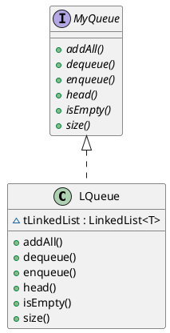

```plantuml
@startuml
class LQueue {
    ~ tLinkedList : LinkedList<T>
    + addAll()
    + dequeue()
    + enqueue()
    + head()
    + isEmpty()
    + size()
}

interface MyQueue {
    {abstract} + addAll()
    {abstract} + dequeue()
    {abstract} + enqueue()
    {abstract} + head()
    {abstract} + isEmpty()
    {abstract} + size()
}


LQueue .up.|> MyQueue
@enduml
```