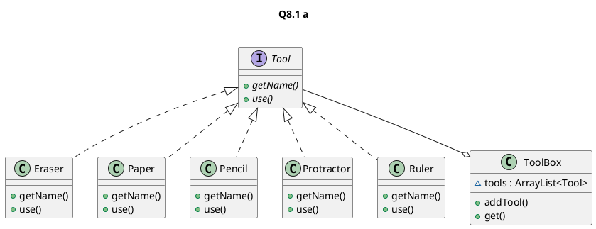

# 8.1
## 8.1 A


## 8.1 B

### Tool.java

```java
interface Tool extends Cloneable {
    /**
     * @return string of the name of the tool
     */
    String getName();

    /**
     * simple interface where the tool will define its usage
     */
    void use();
}
```

### Eraser.java

```java
public class Eraser implements Tool {
    @Override
    public String getName() {
        return "Eraser";
    }

    @Override
    public void use() {
        System.out.println("Using " + getName());
    }
}
```

### Paper.java

```java
public class Paper implements Tool {
    @Override
    public String getName() {
        return "Paper";
    }

    @Override
    public void use() {
        System.out.println("Using " + getName());
    }
}
```

### Pencil.java

```java
public class Pencil implements Tool {
    @Override
    public String getName() {
        return "Pencil";
    }

    @Override
    public void use() {
        System.out.println("Using " + getName());
    }
}
```

### Protractor.java

```java
public class Protractor implements Tool {
    @Override
    public String getName() {
        return "Protractor";
    }

    @Override
    public void use() {
        System.out.println("Using " + getName());
    }
}
```

### Ruler.java

```java
public class Ruler implements Tool {
    @Override
    public String getName() {
        return "Ruler";
    }

    @Override
    public void use() {
        System.out.println("Using " + getName());
    }
}
```

## 8.1 C

### Toolbox.java

```java
import java.util.ArrayList;
import java.util.NoSuchElementException;

public class ToolBox {
    ArrayList<Tool> tools = new ArrayList();

    /**
     * @param tool too be added to the list of tools
     */
    public void addTool(Tool tool){
        tools.add(tool);
    }

    /**
     * Search for the tool with a matching name
     * @param name to search in the list of tools
     * @return returns the found tool in the list
     * @throws NoSuchElementException - when the tool was not found
     */
    public Tool get(String name) throws NoSuchElementException {
        for(Tool tool: tools){
            if(tool.getName().equals(name)){
                return tool;
            }
        }
        throw new NoSuchElementException();
    }
}
```

###ToolTest.java

```java
import java.util.NoSuchElementException;

public class ToolTest {

    public static void main(String[] args) {
        ToolBox toolBox = new ToolBox();

        toolBox.addTool(new Eraser());
        toolBox.addTool(new Paper());
        toolBox.addTool(new Pencil());
        toolBox.addTool(new Protractor());
        toolBox.addTool(new Ruler());

        Tool eraser = toolBox.get("Eraser");
        eraser.use();
        Tool paper = toolBox.get("Paper");
        paper.use();
        Tool pencil = toolBox.get("Pencil");
        pencil.use();
        Tool protractor = toolBox.get("Protractor");
        protractor.use();
        Tool ruler = toolBox.get("Ruler");
        ruler.use();
        try{
            toolBox.get("Tape");
        }catch (NoSuchElementException e){
            System.out.println("Caught expected NoSuchElementException for Tape tool");
        }


    }
}
```
### output

```
> Task :ToolTest.main()
Using Eraser
Using Paper
Using Pencil
Using Protractor
Using Ruler
Caught expected NoSuchElementException for Tape tool

BUILD SUCCESSFUL in 7s
2 actionable tasks: 2 executed
3:20:16 AM: Task execution finished 'ToolTest.main()'.
```

# 9.1

## Summer.java

```java
import java.util.Random;

public class Summer {

    int total = 0;
    int threadCountComplete = 0;

    /**
     * @param n the upper limit
     * @param k the number of threads
     * @return the sum 1 + 2 + ... + n computed with k threads
     * @throws InterruptedException possible for a thread to be interrupted
     */
    int sum(int n, int k) throws InterruptedException {
        for (int j = 0; j < k; j++) {
            final int finalJ = j;
            new Thread(() -> {
                try {
                    //The +1 is to shift the window to start a 1 and to include N
                    int start = (finalJ *n/k) + 1;
                    int end = ((finalJ + 1) * n/k) + 1;
                    addToTotal(addRange(start, end));
                    markThreadComplete();
                } catch (InterruptedException e) {
                    e.printStackTrace();
                }
            }).start();
        }

        //Wait until all the threads have been completed
        while (threadCountComplete != k) {
            Thread.sleep(20);
        }

        threadCountComplete = 0; // reset the thread complete counts
        //Reset the total for another run
        int localTotal = total;
        total = 0;
        return localTotal;
    }

    /**
     * @param subTotal Adding the sub total to a thread protected total
     * @throws InterruptedException possible for a thread to be interrupted
     */
    public synchronized void addToTotal(int subTotal) throws InterruptedException {
        total += subTotal;
    }

    /**
     * Count of the threads that have finished processing
     * @throws InterruptedException possible for a thread to be interrupted
     */
    public synchronized void markThreadComplete() throws InterruptedException {
        threadCountComplete += 1;
    }

    /**
     * Simple function to add a range of values
     * @param start start range to be added
     * @param end end range to be added but not included
     * @return total between [start,end)
     */
    int addRange(int start, int end) {
        int localTotal = 0;
        for (int i = start; i < end; i++) {
            localTotal += i;
        }
        return localTotal;
    }

    public static void main(String[] args) throws InterruptedException {
        Summer summer = new Summer();
        Random random = new Random();
        // Test 5 random numbers with random number of loops

        System.out.println("Testing 5 random numbers with random number of threads");
        System.out.println("|Number test|# of threads\t|Summer Total\t|Formula total\t|Equal?|");
        for (int i = 0; i < 5; i++) {
            int n = random.nextInt(6204);
            int randThreads = random.nextInt(42);
            int total = summer.sum(n, randThreads);
            int testSum = n * (n+1) / 2;
            System.out.println("|" + n + "\t\t|" + randThreads + "\t\t\t\t|" + total + "\t\t|" + testSum + "\t\t|" + (total == testSum) );
        }
    }
}

```

## output
```text
> Task :Summer.main()
Testing 5 random numbers with random number of threads
|Number test|# of threads	|Summer Total	|Formula total	|Equal?|
|5512		|9				|15193828		|15193828		|true
|5087		|9				|12941328		|12941328		|true
|2025		|20				|2051325		|2051325		|true
|5271		|1				|13894356		|13894356		|true
|2377		|15				|2826253		|2826253		|true

BUILD SUCCESSFUL in 0s
2 actionable tasks: 2 executed
3:27:53 AM: Task execution finished 'Summer.main()'.
```