# Path Finding Algorithm Analysis, Spring 2020 
## Group 2 - Object Oriented Software Design
## Adam Corbin - March 2020

# Functional Specification  
# Description
This application will dive into the different types of path finding algorithms games use in order to come up with the generated 
path when a character or player selects a destination position. This project will have a visual progression of the algorithms 
so that a human can see how well they preform between each other. I would like to evaluate different situations to find 
positives and negatives between the algorithms such as best case and worst-case scenarios. Statistic analysis will also 
be done to evaluate how well they rank between each other.

## List of things that this program will do
- Visual graph representing at least 1 or more algorithms running over time
- A way to view the results between the different algorithm
- A way for a human to pick start and destination points.
- A way to auto pick start and destination points

This will run on Windows 10 OS using Swing

## Intended users
- Any game developers who want to consider different options for path finding.
- Anyone who wants to understand how path finding algorithms work.

# Application Requirements

### Functional Requirements

1. **F.R-1**: The system shall generate a path given a start point, and end point, and the selected algorithm
2. **F.R-2**: The system shall let the user know if a path is not possible to be created
3. **F.R-3**: The system shall provide statistics on the different algorithms
4. **F.R-4**: The system shall find worst case scenario for each algorithm given the scenario
5. **F.R-5**: The system shall run a simulation to compare the differences between the algorithms using simple statistics 
6. **F.R-6**: The system shall be able to generate a new random graph
7. **F.R-7**: The system shall be able to generate a new random start and end position

### UI Requirements

1. **UI.R-1**: The UI shall be able to select a starting point and an end point
2. **UI.R-2**: The UI shall have a button to start the simulation
3. **UI.R-3**: The UI shall be able to see the algorithms behave over time where a human can visually see
4. **UI.R-4**: The UI shall have the ability to auto pick the 2 points
5. **UI.R-5**: The UI shall have the ability to select which algorithms to use for the simulation
6. **UI.R-6**: The UI shall have a table comparing the different algorithms
7. **UI.R-7**: The UI shall have multiple size graphs to pick from  


## Use Cases

### UC-1: User selects a  path
1. The user selects the start and end points and uses default algorithm
2. The system computes the path generation
3. The system displays a successful path

### UC-2: User selects a path

#### Variation #1:  Invalid path
1. After step 2 , the system displays the path could not be found 

### UC-3: Computer generates path 
1. The user selects for the system to pick 2 random points on the graph
2. The system picks 2 random points
3. The system computes the path generation
4. The system displays a successful path

### UC-4: Computer generates path 

#### Variation #1: Invalid path
1. After step 2, the system displays that the path could not be found

### UC-5: User selects a different algorithm
1. The user selects the start and end points
2. The user changes the default algorithm to another selection
3. The system computes the path generation
4. The system displays the successful path 

### User selects points from history
1. The user picks from this history list to switch back to
2. The system regenerates the path from the history
3. The system displays the generated path 

### UC-6: System populates algorithm comparator  
1. The user selects all the algorithms to run for the simulation
2. The user picks the 2 points
3. The system generates the paths for each algorithm
4. The system displays a ranking order between each algorithm with some statistics. 

## Use Cases updated after GUI elements

### UC-1: User selects a  path
1. The user enters the coordinates in the start position text field and end position text filed
1. The user selects the first algorithm JComboBox
1. The user presses the Generate Path button
1. The system computes the path generation
1. The system displays a successful path on the grid JComponent

### UC-2: User selects a path

#### Variation #1:  Invalid path
1. After step 2 , the system displays no the path on the graph

### UC-3: Computer generates path 
1. The user presses the generate Generate Random Path button
1. The system picks 2 random points and fills in the start and end JTextField with the positions
1. The user presses the Compute Path buttons
1. The system computes the path generation
1. The system displays a successful path on the grid JComponent

### UC-4: Computer generates path 

#### Variation #1: Invalid path
1. After step 2, the system displays that the path could not be found

### UC-5: User selects a different algorithm
1. The user enters the coordinates in the start position text field and end position text filed
1. The user checks the a different algorithm JComboBox than the first
1. The user presses the Generate Path buttons
1. The system computes the path generation
1. The system displays a successful path on the grid JComponent


### UC-6: System populates algorithm comparator  
1. The user enters the coordinates in the start position text field and end position text filed
1. The user presses the Compute Comparison buttons
1. The system generates the paths for each algorithm
1. The system displays the results between each algorithm with some statistics in the algorithm results JTable

### UC-7: Generate New Graph
1. The user presses the New Graph button
1. the system will clear the graph JComponent
1. the system will then repopulate GridModel blocking elements
1. The system will then repaint the graph JComponent

### UC-8: Generate graph from text fields
1. The user enters the coordinates in the start position text field and end position text filed
1. The system automatically computes the path generation
1. The system displays a successful path on the grid JComponent

# User Interface

## Mockup


Link: https://gomockingbird.com/projects/v95sylo/4gXVnC

# Design Specification 

## CRC cards

### Tile
- Responsibilities
	- Coordinate on a map that is used to represent a node or a position
- Collaborators
	- Path
	
### Path
- Responsibilities
	- An ordered list of tiles that will be used to represent chain of tiles to get from start to finish
- Collaborators
	- Tile
	- Algorithm
	- AlgorithmController
	
### Algorithm 
- Responsibilities
	- Steps to find a path between a departure and destination position
- Collaborators
	- AlgorithmController
	- Path
	
### Grid 
- Responsibilities
	- Showing start and end tiles of a path
	- showing the different paths for the algorithms
	- Showing the visited tiles of the algorithms
- Collaborators
	- GUIView
	- Path
	- Tile
	
### GridTile
- Responsibilities
	- Keeping track of what colors should the tile display in the grid
	- collision flag of the tile
- Collaborators
	- Grid

### AlgorithmController
- Responsibilities
	- Keeping track which algorithms are selected
	- Running the simulations
	- Keeps track of past history of the departure and destination tiles
	- Simulator that runs the algorithms and collects the comparative results
	- Keeps track of the tiles visited while going through the algorithm
	- Keeps track of optimized path for each algorithm 
- Collaborators
	- GUIView
	- Grid
	- Algorithm
	
### GUIView 
- Responsibilities
	- Displaying the grid
	- Displaying the start and end positions
	- Selectable algorithms
	- Displaying the comparison results of the different algorithms
	- Selectable history of past start and end positions	
- Collaborators
	- AlgorithmController


	
## UML Diagrams

### Patterns
- Observer pattern All the buttons, text fields, and JComboBoxes with Action listeners

|Name in Design Pattern|Actual Name|
|----|----|
|Subject | JButton & JComboBox, JTextField|
|Observer| ActionListener|
|ConcreteObserver | AlgorithmController has 4 buttons, 2 JComboBoxes, and 2 JTextFields with action listeners it implemented| 
|attach()| addActionListener|
|notify()| actionPerformed|

- Singleton - The GUIView uses a Singleton pattern. I couldnt find a table in the book for this pattern. 


- Composite pattern - GridTiles with parent as an object. This is used to build the path where GridTiles link between
each other

|Name in Design Pattern|Actual Name|
|----|----|
|Primitive| GridTile|
|Composite| GridTile it self|
|Leaf | Tile|
|method()| getParent()|

- Adapter pattern - With AlgotStatsModel updating table

|Name in Design Pattern|Actual Name|
|----|----|
|Adaptee| JTable|
|Target| AlgorithmStatModel|
|Adapter| AbstractTableModel|
|Client| The class that wants to add rows to a table|
|targetMethod()|fireTableDataChanged() |
|adapteeMethod()| getValueAt(),getColumnCount(), getRowCount(), getColumnName() |

- Strategy pattern - GridBag

|Name in Design Pattern|Actual Name|
|----|----|
|Context| GUIView| 
|Strategy| LayoutManager|
|ConcreteStrategy| GridBagLayout|
|doWork()| A method of the LayoutManager interface type such as layoutContainer|


### Class diagrams

#### Overall UML Diagram\


 

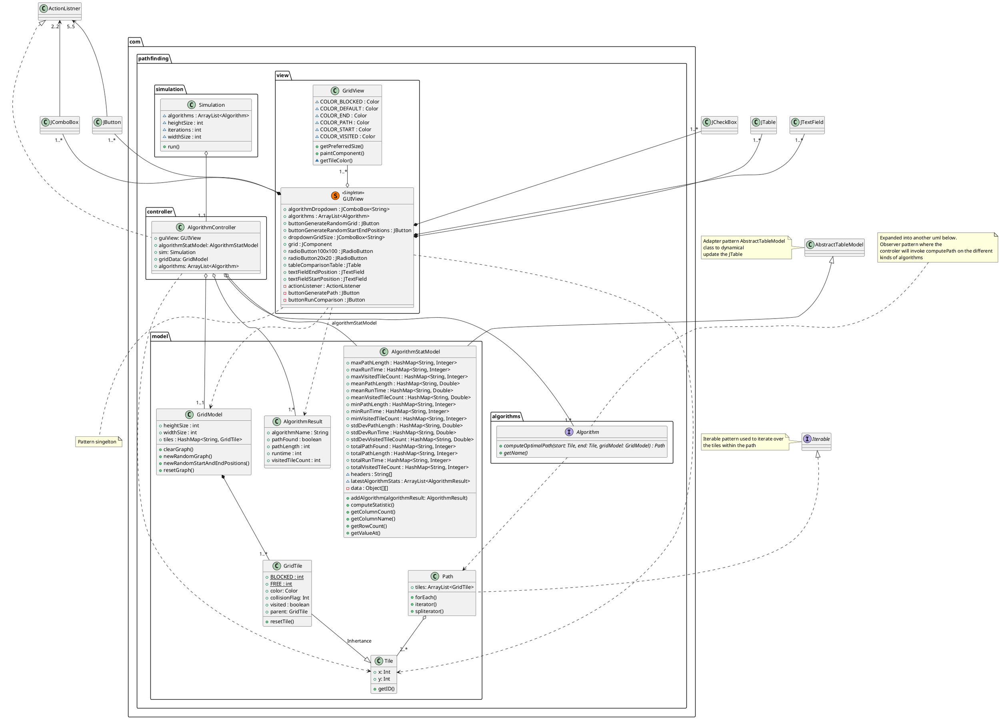


Clear picture in link below. Also opening PDF All uml diagrams are clickable to a PNG that can be zoomed in: 

http://www.plantuml.com/plantuml/png/dLXjRziu3FwkNq7qlhJBOdG5XW514InhagsxRWtIh5-6uQ3OIgARBHcMtAJBTR_zA5b-IUAyU0MAsXH9aO-eXtJVAqqJdKOXKJ-vY6b28rWJya88yKEg5FWoycAg5pCk0YxcNYG35deJ7h8rWHQiEd0hj7bwpfvQC6Vwjdz-ONmSSZ522V0e3bd4X5Pmgrb2fyPjIwDtrO5Uaj3dEwxqzSU41sRBBhgVoMH0_GLkq09kRBHCx8kAmyhx2n5ICmZPJ9FSDM0K-2WWLIm0BPqz0_d44g8N3EpEiEHwmGKOWOcRC160yKQEeD8Bvp91ssZCL1fgp0HeBlfA8mOTUD09wkE2iHxA53rtO2fboAXmqZicvWXD1xY5Cqc5vjOsUt_Y2iEsSDoWlNOBHz3E4LoJDPwuvluB7jc7k_kRlmTzvw6oC1mF1lc6lWnbqe4RyyU-XHY05CEGpjs9kuYgYM0XuQ5s8D_MvC4Kq-RvU6aOgo_coI2uO7o-q0_yLmd1aWTwiI79pgq3dwXQVA7nTGRpQwWMZe-X9HyJ6cUr8zXoJ4KWenhHWxaKFH4CH32Ic1pcgwo6JI8tU3cn6j2Rjka0Msci9GMzgT89zVN4LANB5F2d1H5TZQeri9qG0ixcBEcMwkDKJBBwEAxxk5ixnupmE0y6r9VfrE1RgkyFQ5VtX82sZBXeX0yNf-F3HNDyb0xwxAa1Gfd1gHXbserHqbBJS5HXc2DP5FgduceDJaRMQZV5zZVUV1gmH1Mi-Vs7MmYHivNUk5z6g-mNMqISEMn3G3L5lVlflypNttyuVqZIGL1OdDDDMtIxARXmHdZfurGpipbkoVtpV07x7v9b6WcRvgxOT8AgT2oNEvgFD4nPJs_riLv0O-nOHHlRfH5mZ8IzBNWMDE8-3KaQ1wR9cNRssQf2fQCXVx9aHdssms854AgaCiXuQatTpYyb4FSnjgciYixjKD41SzQl0VVA7-SviMUTmJvUu8aOert7Y8F3oe6WPKm6gnWf6hiD1Yw1edo1YE000rCMogK7v7wgMF9KWMc96bdwn9T29zYZ4kmXOOW-dkHFbcTW9nAPzVs0psRCz322On4ojfoLhLnLuAjl06uRtAU4xgQGOLURf_oHioN2yEtMF01fqPrsKIczGaPQYaTu8NYKuYt0leI-4Ca-LdO5quetLNilkcR4osB__27LMefryMvBf7ozaT5KVf2hzTvszuG9s9vjCrcxItfpVtS__gSSCR81ehhM7mnxt-ucjMk3h_KsezxaK-t2mwGthdVrUFjmEzaAmHRNA65unWaBp2XHtBwOOcLXqh4KhBYKlur-HbsX6oyFOU4EzVeQpXzU_pKSldjtUNc1XoRc8KEieTlTc0txYOm3kHGOOW6t8yLkLMyFoHcTgJt4ZqpOWJOVRBZXVdV0UvJig5ETSpOi0XUPSUK6hhe8vswd0ZOpAj60oypHcylB5VuQZN4ftTIvkbnTrMXeKup6BKsuaYAZhuuhKhEE8zMGix0wgjdrN5xLiRdMQxK1IGUb1bc3Zq5wGu0Qc_1PjYYnofUnAPRXLjOTXKqblaLavAX98O0iDEl7A4KLDzuhBtznsOwNIDvIjuRfJ9nz1xdJByNRStPsGV23n0s_ZLWFPBjz-gJSWLq-tDsn7XIpqTaRptjprf2O_oIZFHjjVSYG8-lmohbwTNRa0uuSNePs-x_kWOzsCDzis0yr5Vu-NraVD05T7GZ81aC8_25eDNxh1WvoqbJYUTq3_sKWkuMpGTFxhVUVtuaEQa_iHDkjkPCu9e5s6hUxSFRMyzwULKZAS5J1pRaI7k3LjjB1S5uPmxmIS-vgO947qCIcPE4cHhO1D8bimVoVHoEJLPk3WqvZ_lFIsCExUUGqZjuUquxttQ3wmcaQv-5g9kGzzYeSkFy7


### Algorithms package uml\


```plantuml
@startuml
interface com.pathfinding.algorithms.Algorithm {
    {abstract} + computeOptimalPath(start: Tile, end: Tile, gridModel: GridModel) : Path
    {abstract} + getName()
}
note top: Observer pattern using multiple different instances of Algorithm


Class com.pathfinding.algorithms.AStar{
~ closedList : ArrayList<AStarGridTile>
~ openList : ArrayList<AStarGridTile>
~ path : ArrayList<GridTile>
+ computeOptimalPath(): Path
+ getName(): String
}
class com.pathfinding.algorithms.AStar.AStarGridTile {
    + g : double
    + h : double
    + compareTo()
}

com.pathfinding.algorithms.AStar .u.|> com.pathfinding.algorithms.Algorithm

Class com.pathfinding.algorithms.BFS{
+ getName(): String
+computeOptimalPath(): Path
}
com.pathfinding.algorithms.BFS .u.|> com.pathfinding.algorithms.Algorithm

Class com.pathfinding.algorithms.DSF{
+ getName(): String
+visitedTiles: ArrayList<Tile>
+computeOptimalPath(): Path
}
com.pathfinding.algorithms.DSF .u.|> com.pathfinding.algorithms.Algorithm

com.pathfinding.algorithms.AStar o-- com.pathfinding.algorithms.AStar.AStarGridTile : currentTile
@enduml
```

### View package uml\

 
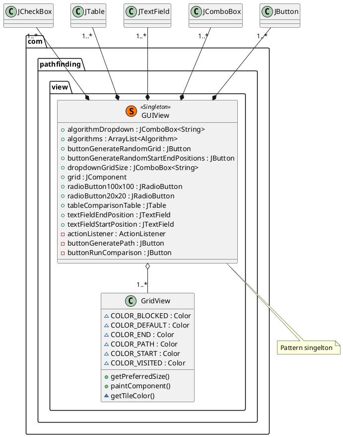

### Model package uml\
 
 
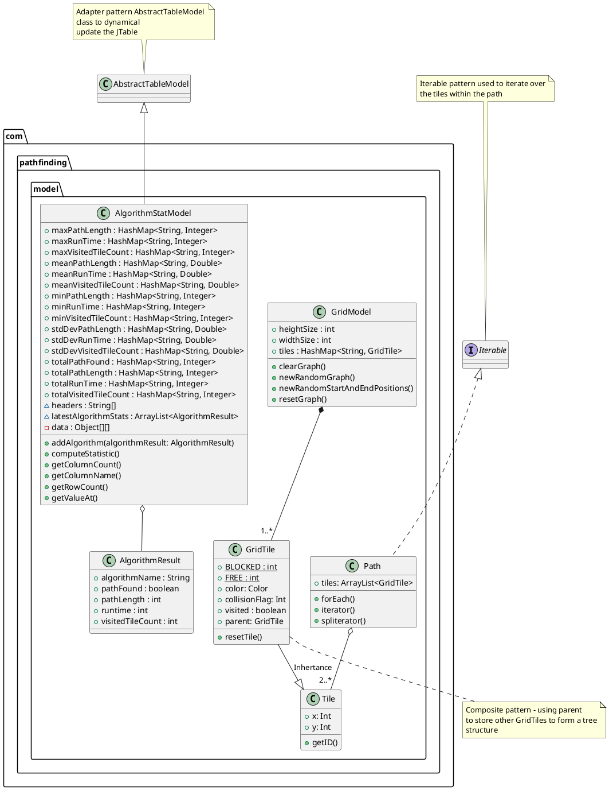

### Sequence Diagrams

#### Path found\
 
 

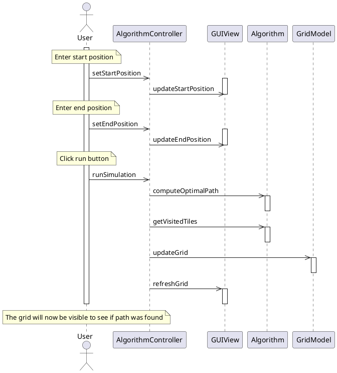

#### Computer generated path found\


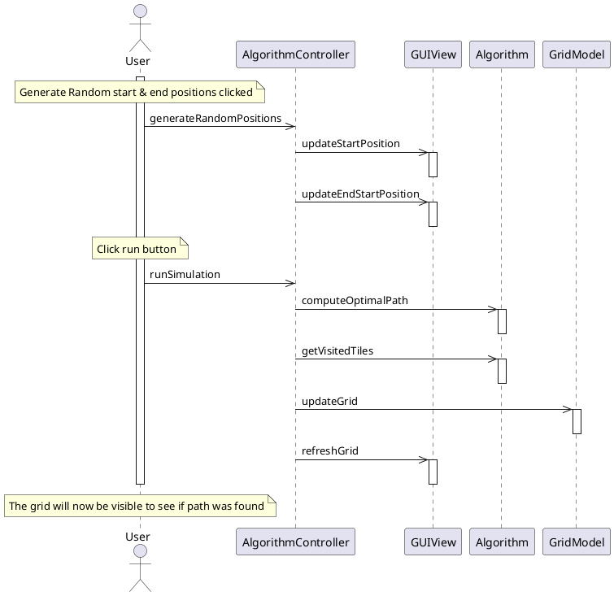

#### Selecting different Algorithm\


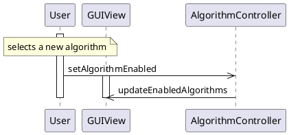

#### Compare algorithms\


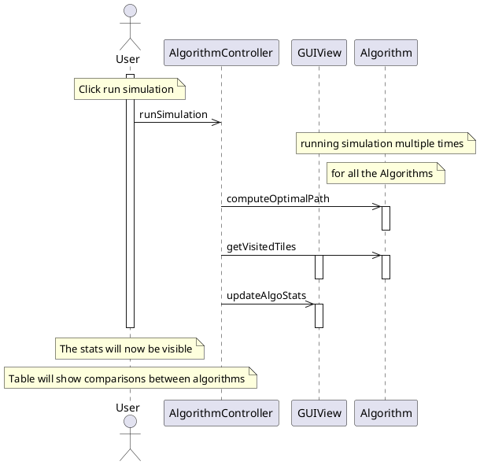

### State Diagrams

#### Path Found\

  
 
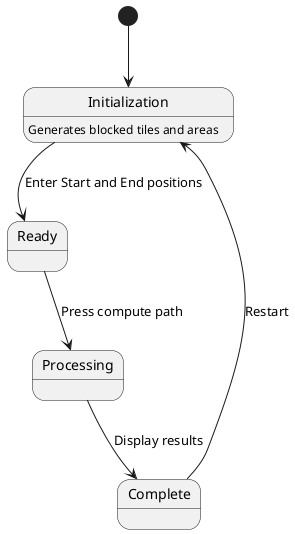

#### Computer Generated Path found\

 
 
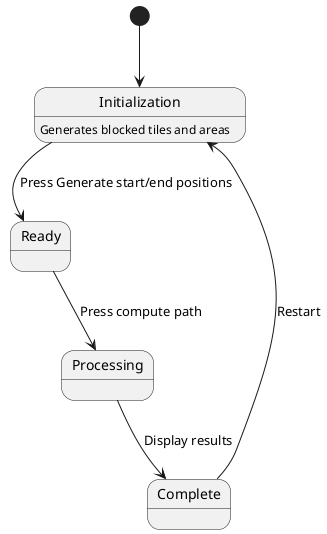

#### Path not found found\

 
 
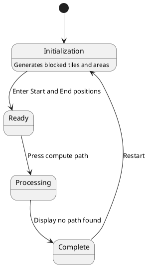

#### Generate new Graph\
 
  

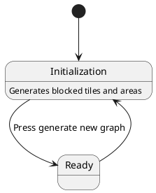

# Screenshots


# Code

## Algorithms Package
### Algorithm.java

```java
package com.pathfinding.algorithms;

import com.pathfinding.model.GridModel;
import com.pathfinding.model.Path;
import com.pathfinding.model.Tile;

/**
 * This interface is use to set the infrastructure for all Algorithm types
 */
public interface Algorithm {
    String getName();

    Path computeOptimalPath(Tile start, Tile end, GridModel gridModel);
}
```

### AStar.java

```java
package com.pathfinding.algorithms;

import com.pathfinding.model.GridModel;
import com.pathfinding.model.GridTile;
import com.pathfinding.model.Path;
import com.pathfinding.model.Tile;

import java.util.ArrayList;
import java.util.Collections;
import java.util.List;

/**
 * This Algorithm will implment the A* path finding method. Its suppose to be the most efficent of the set.
 */
public class AStar implements Algorithm {

    ArrayList<AStarGridTile> openList = new ArrayList<>();
    ArrayList<AStarGridTile> closedList = new ArrayList<>();
    ArrayList<GridTile> path = new ArrayList<>();
    AStarGridTile currentTile;
    Tile end;

    /**
     * Looks in a list to see if tile is found
     *
     * @param array list of tiles
     * @param tile  request tile to see if in list
     * @return true == in list, false == not in list
     */
    private static boolean findNeighborInList(List<AStarGridTile> array, AStarGridTile tile) {
        for (AStarGridTile listTile : array) {
            if (listTile.x == tile.x && listTile.y == tile.y) {
                return true;
            }
        }
        return false;
    }

    @Override
    public String getName() {
        return "A*";
    }

    /**
     * This method will find the path between start and end tiles
     * <p>
     * Reference to this source: https://rosettacode.org/wiki/A*_search_algorithm#Java
     *
     * @param start     - which tile to start from
     * @param end       - which tile to go to and finish
     * @param gridModel - The predefined model that the algo will run on
     * @return - The path between start and end. If no path found it will return an empty list
     * @precondition - gridModel is expected to be already initialized.
     */
    @Override
    public Path computeOptimalPath(Tile start, Tile end, GridModel gridModel) {
        //Clear out all instance variables between different runs
        openList.clear();
        closedList.clear();
        path.clear();
        gridModel.resetGraph();

        this.end = end;
        currentTile = new AStarGridTile(null, gridModel.tiles.get(start.getID()), 0, 0);
        closedList.add(currentTile);
        addNeighborsToOpenList(gridModel);

        while (this.currentTile.x != this.end.x || this.currentTile.y != this.end.y) {
            if (this.openList.isEmpty()) { // Nothing to examine
                return new Path();
            }
            this.currentTile = this.openList.get(0); // get first node (lowest f score)
            this.openList.remove(0); // remove it
            this.closedList.add(this.currentTile); // and add to the closed
            addNeighborsToOpenList(gridModel);
        }
        this.path.add(0, this.currentTile);
        while (this.currentTile.x != start.x || this.currentTile.y != start.y) {
            this.currentTile = this.currentTile.parent;
            this.path.add(0, this.currentTile);
        }
        return new Path(this.path);

    }

    /**
     * This method will add all the tiles around the current tile
     *
     * @param gridModel used to look at dimentions of the graph to ensure we dont go out of bounds
     */
    private void addNeighborsToOpenList(GridModel gridModel) {
        AStarGridTile gridTile;
        for (int x = -1; x <= 1; x++) {
            for (int y = -1; y <= 1; y++) {
                int observedX = x + currentTile.x;
                int observedY = y + currentTile.y;

                if (x != 0 && y != 0) {
                    continue; // skip if diagonal movement
                }

                if (((x != 0 || y != 0) // not this.currentTile
                        && this.currentTile.x + x >= 0 && this.currentTile.x + x < gridModel.widthSize // check maze boundaries
                        && this.currentTile.y + y >= 0 && this.currentTile.y + y < gridModel.heightSize)) {
                    gridTile = new AStarGridTile(currentTile, gridModel.tiles.get(observedX + "," + observedY), currentTile.g, distance(x, y));

                    if (gridTile.collisionFlag == GridTile.FREE // check if square is walkable
                            && !findNeighborInList(this.openList, gridTile) && !findNeighborInList(this.closedList, gridTile)) { // if not already done

                        gridTile.g = gridTile.parent.g + 1.; // Horizontal/vertical cost = 1.0
                        gridModel.tiles.get(observedX + "," + observedY).visited = true;
                        this.openList.add(gridTile);
                    }
                }
            }
        }
        Collections.sort(this.openList);
    }

    /**
     * Calculate distance between this.currentTile and xend/yend
     *
     * @param dx destination x
     * @param dy destination y
     * @return the distance between tile(dx,dy) and the current tile
     */
    private double distance(int dx, int dy) {
        return Math.abs(this.currentTile.x + dx - this.end.x) + Math.abs(this.currentTile.y + dy - this.end.y);
    }

    /**
     * Wrapper class to GridTile to support A* computations to save off g and h
     */
    static class AStarGridTile extends GridTile implements Comparable {
        public AStarGridTile parent;
        public double g;
        public double h;

        public AStarGridTile(AStarGridTile parent, GridTile tile, double g, double h) {
            super(tile);
            this.collisionFlag = tile.collisionFlag;
            this.parent = parent;
            this.g = g;
            this.h = h;
        }

        /**
         * Compare by f value (g + h)
         *
         * @param o input tile to compute if its a good tile to look at
         * @return - f
         */
        //
        @Override
        public int compareTo(Object o) {
            AStarGridTile that = (AStarGridTile) o;
            return (int) ((this.g + this.h) - (that.g + that.h));
        }
    }
}
```

### BDS.java

```java
package com.pathfinding.algorithms;

import com.pathfinding.model.GridModel;
import com.pathfinding.model.GridTile;
import com.pathfinding.model.Path;
import com.pathfinding.model.Tile;

import java.util.ArrayList;
import java.util.LinkedList;
import java.util.Queue;

/**
 * Implementation of Breadth First Search
 */
public class BFS implements Algorithm {

    @Override
    public String getName() {
        return "Breadth First Search";
    }

    /**
     * BFS takes a look at all the squares around given square before looking at any deeper squares.
     *
     * @param start     - which tile to start from
     * @param end       - which tile to go to and finish
     * @param gridModel - The predefined model that the algo will run on
     * @return - The path between start and end. If no path found it will return an empty list
     * @precondition - gridModel is expected to be already initialized.
     */
    @Override
    public Path computeOptimalPath(Tile start, Tile end, GridModel gridModel) {

        gridModel.resetGraph();
        Queue<GridTile> queue = new LinkedList<>();
        queue.add(gridModel.tiles.get(start.getID()));
        int level = 0;

        while (!queue.isEmpty()) {
            Tile pos = queue.remove();
            int row = pos.x;
            int col = pos.y;

            GridTile currentTile = gridModel.tiles.get(row + "," + col);
            if (row < 0 || col < 0 || row >= gridModel.heightSize || col >= gridModel.widthSize || currentTile.visited)
                continue;

            //Break out of loop if we found our end tile
            if (currentTile.x == end.x && currentTile.y == end.y) {
                ArrayList<GridTile> tilesForPath = new ArrayList<>();
                GridTile parent = currentTile.parent;
                tilesForPath.add(currentTile);
                while (parent != null) {
                    tilesForPath.add(parent);
                    parent = parent.parent;
                }
                queue.clear();
                return new Path(tilesForPath);
            }
            //Ensure to not set visited on start or end tiles
            if (currentTile.collisionFlag == GridTile.FREE && !(currentTile.x == start.x && currentTile.y == start.y)) {
                currentTile.visited = true;
            }

            // Only push items on the stack if they are free
            if (col > 0) {
                GridTile left = gridModel.tiles.get(row + "," + (col - 1));
                if (left.collisionFlag == GridTile.FREE) {
                    try {
                        left.parent = currentTile.clone();
                    } catch (CloneNotSupportedException e) {
                        e.printStackTrace();
                    }
                    queue.add(left); //go left

                }
            }

            if (col + 1 < gridModel.widthSize) {
                GridTile right = gridModel.tiles.get(row + "," + (col + 1));
                if (right.collisionFlag == GridTile.FREE) {
                    try {
                        right.parent = currentTile.clone();
                    } catch (CloneNotSupportedException e) {
                        e.printStackTrace();
                    }
                    queue.add(right); //go right
                }
            }

            if (row > 0) {
                GridTile up = gridModel.tiles.get((row - 1) + "," + col);
                if (up.collisionFlag == GridTile.FREE) {
                    try {
                        up.parent = currentTile.clone();
                    } catch (CloneNotSupportedException e) {
                        e.printStackTrace();
                    }
                    queue.add(up); //go up
                }
            }

            if (row + 1 < gridModel.heightSize) {
                GridTile down = gridModel.tiles.get((row + 1) + "," + col);
                if (down.collisionFlag == GridTile.FREE) {
                    try {
                        down.parent = currentTile.clone();
                    } catch (CloneNotSupportedException e) {
                        e.printStackTrace();
                    }
                    queue.add(down); //go down
                }
            }
        }
        return new Path(new ArrayList<>());
    }

}
```

### DFS.java

```java
package com.pathfinding.algorithms;

import com.pathfinding.model.GridModel;
import com.pathfinding.model.GridTile;
import com.pathfinding.model.Path;
import com.pathfinding.model.Tile;

import java.util.ArrayList;
import java.util.Stack;

/**
 * Implementation of Depth First Search
 */
public class DFS implements Algorithm {

    @Override
    public String getName() {
        return "Depth First Search";
    }

    /**
     * Another resource: https://medium.com/omarelgabrys-blog/path-finding-algorithms-f65a8902eb40
     * 1. Add root node to the stack.
     * 2. Loop on the stack as long as it's not empty.
     * 1. Get the node at the top of the stack(current), mark it as visited, and remove it.
     * 2. For every non-visited child of the current node, do the following:
     * 1. Check if it's the goal node, If so, then return this child node.
     * 2. Otherwise, push it to the stack.
     * 3. If stack is empty, then goal node was not found!
     *
     * @param start     - which tile to start from
     * @param end       - which tile to go to and finish
     * @param gridModel - The predefined model that the algo will run on
     * @return - The path between start and end. If no path found it will return an empty list
     * @precondition - gridModel is expected to be already initialized.
     */
    @Override
    public Path computeOptimalPath(Tile start, Tile end, GridModel gridModel) {
        gridModel.resetGraph();
        boolean[][] visited = new boolean[gridModel.heightSize][gridModel.widthSize];

        Stack<Tile> stack = new Stack<>();
        stack.push(start);

        while (!stack.empty()) {
            Tile pos = stack.pop();
            int row = pos.x;
            int col = pos.y;

            if (row < 0 || col < 0 || row >= gridModel.heightSize || col >= gridModel.widthSize || visited[row][col])
                continue;

            visited[row][col] = true;
            GridTile currentTile = gridModel.tiles.get(row + "," + col);


            //Break out of loop if we found our end tile
            if (currentTile.x == end.x && currentTile.y == end.y) {
                ArrayList<GridTile> tilesForPath = new ArrayList<>();
                GridTile parent = currentTile.parent;
                tilesForPath.add(currentTile);
                while (parent != null) {
                    tilesForPath.add(parent);
                    parent = parent.parent;
                }
                stack.clear();
                return new Path(tilesForPath);
            }
            //Ensure to not set visited on start or end tiles
            if (currentTile.collisionFlag == GridTile.FREE && (currentTile.x != start.x && currentTile.y != start.y))
                currentTile.visited = true;


            // Only push items on the stack if they are free
            if (col > 0) {
                GridTile left = gridModel.tiles.get(row + "," + (col - 1));
                if (left.collisionFlag == GridTile.FREE) {
                    try {
                        left.parent = currentTile.clone();
                    } catch (CloneNotSupportedException e) {
                        e.printStackTrace();
                    }
                    stack.push(left); //go left
                }
            }

            if (col + 1 < gridModel.widthSize) {
                GridTile right = gridModel.tiles.get(row + "," + (col + 1));
                if (right.collisionFlag == GridTile.FREE) {
                    try {
                        right.parent = currentTile.clone();
                    } catch (CloneNotSupportedException e) {
                        e.printStackTrace();
                    }
                    stack.push(right); //go right
                }
            }

            if (row > 0) {
                GridTile up = gridModel.tiles.get((row - 1) + "," + col);
                if (up.collisionFlag == GridTile.FREE) {
                    try {
                        up.parent = currentTile.clone();
                    } catch (CloneNotSupportedException e) {
                        e.printStackTrace();
                    }
                    stack.push(up); //go up

                }
            }

            if (row + 1 < gridModel.heightSize) {
                GridTile down = gridModel.tiles.get((row + 1) + "," + col);
                if (down.collisionFlag == GridTile.FREE) {
                    try {
                        down.parent = currentTile.clone();
                    } catch (CloneNotSupportedException e) {
                        e.printStackTrace();
                    }
                    stack.push(down); //go down
                }
            }


        }
        return null;
    }

}
```

## Controller package

### AlgorithmController.java

```java
package com.pathfinding.controller;

import com.pathfinding.algorithms.AStar;
import com.pathfinding.algorithms.Algorithm;
import com.pathfinding.algorithms.BFS;
import com.pathfinding.algorithms.DFS;
import com.pathfinding.model.AlgorithmStatModel;
import com.pathfinding.model.GridModel;
import com.pathfinding.model.GridTile;
import com.pathfinding.simulation.Simulation;
import com.pathfinding.view.GUIView;

import javax.swing.*;
import java.awt.event.KeyEvent;
import java.awt.event.KeyListener;
import java.util.ArrayList;

/**
 * This is the master controller in the MVC pattern
 * It will handle the Observer pasterns between the GUI and Model with the Action listeners
 * It will also handle the creation of all the Models and Views
 */
public class AlgorithmController {
    GridModel gridModel;

    ArrayList<Algorithm> algorithms = new ArrayList<>();
    GUIView guiView;
    AlgorithmStatModel algorithmStatModel;
    Simulation sim;

    int selectedAlgoIndex = 0;

    AlgorithmController() {
        //Create gridModel

        gridModel = new GridModel(20, 20);
        algorithms.add(new DFS());
        algorithms.add(new BFS());
        algorithms.add(new AStar());
        String[] columnNames = new String[algorithms.size() + 1];
        columnNames[0] = "Statistics";
        for (int i = 0; i < algorithms.size(); i++) {
            columnNames[i + 1] = algorithms.get(i).getName();
        }
        algorithmStatModel = new AlgorithmStatModel(columnNames);
        sim = new Simulation(10, algorithms, 100, 100, algorithmStatModel);
        guiView = GUIView.getInstance(gridModel, algorithms, algorithmStatModel);


        guiView.addALForNewGrid(e -> {
            guiView.gridModel.newRandomGraph();
            guiView.grid.invalidate();
            guiView.grid.validate();
            guiView.grid.repaint();

            //Reset start and end
            guiView.gridModel.startPosition.x = 0;
            guiView.gridModel.startPosition.y = 0;
            guiView.gridModel.endPosition.x = 0;
            guiView.gridModel.endPosition.y = 0;
            guiView.textFieldStartPosition.setText(0 + "," + 0);
            guiView.textFieldEndPosition.setText(0 + "," + 0);
        });

        guiView.algorithmDropdown.addActionListener(e -> selectedAlgoIndex = guiView.algorithmDropdown.getSelectedIndex());

        guiView.dropdownGridSize.addActionListener(e -> {
            if (guiView.dropdownGridSize.getSelectedIndex() == 0) {
                guiView.gridModel.heightSize = 20;
                guiView.gridModel.widthSize = 20;
            } else {
                guiView.gridModel.heightSize = 100;
                guiView.gridModel.widthSize = 100;
            }
            guiView.gridModel.newRandomGraph();
            guiView.grid.invalidate();
            guiView.grid.validate();
            guiView.grid.repaint();
        });

        guiView.textFieldStartPosition.addKeyListener(new KeyListener() {
            @Override
            public void keyTyped(KeyEvent e) {
                checkTextFieldUpdate(guiView.textFieldStartPosition, guiView.gridModel.startPosition);
                gridModel.path = algorithms.get(selectedAlgoIndex).computeOptimalPath(gridModel.startPosition, gridModel.endPosition, gridModel);
            }

            @Override
            public void keyPressed(KeyEvent e) {
                checkTextFieldUpdate(guiView.textFieldStartPosition, guiView.gridModel.startPosition);
                gridModel.path = algorithms.get(selectedAlgoIndex).computeOptimalPath(gridModel.startPosition, gridModel.endPosition, gridModel);
            }

            @Override
            public void keyReleased(KeyEvent e) {
                checkTextFieldUpdate(guiView.textFieldStartPosition, guiView.gridModel.startPosition);
                gridModel.path = algorithms.get(selectedAlgoIndex).computeOptimalPath(gridModel.startPosition, gridModel.endPosition, gridModel);
                guiView.grid.invalidate();
            }
        });

        guiView.textFieldEndPosition.addKeyListener(new KeyListener() {
            @Override
            public void keyTyped(KeyEvent e) {
                checkTextFieldUpdate(guiView.textFieldEndPosition, guiView.gridModel.endPosition);
                gridModel.path = algorithms.get(selectedAlgoIndex).computeOptimalPath(gridModel.startPosition, gridModel.endPosition, gridModel);
                guiView.grid.invalidate();
            }

            @Override
            public void keyPressed(KeyEvent e) {
                checkTextFieldUpdate(guiView.textFieldEndPosition, guiView.gridModel.endPosition);
                gridModel.path = algorithms.get(selectedAlgoIndex).computeOptimalPath(gridModel.startPosition, gridModel.endPosition, gridModel);
                guiView.grid.invalidate();
            }

            @Override
            public void keyReleased(KeyEvent e) {
                checkTextFieldUpdate(guiView.textFieldEndPosition, guiView.gridModel.endPosition);
                gridModel.path = algorithms.get(selectedAlgoIndex).computeOptimalPath(gridModel.startPosition, gridModel.endPosition, gridModel);
                guiView.grid.invalidate();
            }
        });

        guiView.addALForGenerateRandomStartEndPositions(e -> {
            gridModel.newRandomStartAndEndPositions();
            guiView.textFieldStartPosition.setText(gridModel.startPosition.x + "," + gridModel.startPosition.y);
            guiView.textFieldEndPosition.setText(gridModel.endPosition.x + "," + gridModel.endPosition.y);

            gridModel.path = algorithms.get(selectedAlgoIndex).computeOptimalPath(gridModel.startPosition, gridModel.endPosition, gridModel);
            //update view
            guiView.grid.invalidate();
            guiView.grid.validate();
            guiView.grid.repaint();
        });

        guiView.addALForButtonGeneratePath(e -> {
            gridModel.path = algorithms.get(selectedAlgoIndex).computeOptimalPath(gridModel.startPosition, gridModel.endPosition, gridModel);
            //update view
            guiView.grid.invalidate();
            guiView.grid.validate();
            guiView.grid.repaint();
        });

        guiView.addALForButtonRunComparison(e -> {
            sim.run();
            algorithmStatModel.computeStatistic();
            guiView.tableComparisonTable.invalidate();
            guiView.tableComparisonTable.validate();
            guiView.tableComparisonTable.repaint();
        });

    }

    public static void main(String[] args) {
        AlgorithmController algorithmController = new AlgorithmController();

    }

    /**
     * This parses the change from the text field, parses to make sure we have correct coordinates. It will catch any
     * incorrect patterns of "int,int" and print to the console. Once parsed it will then update the model and then
     * re-validate the View
     *
     * @param jTextField input filed to parse
     * @param position   the model to update
     */
    private void checkTextFieldUpdate(JTextField jTextField, GridTile position) {
        String fieldText = jTextField.getText();
        String[] split = fieldText.split(",");
        if (split.length == 2) {
            try {
                int x = Integer.parseInt(split[0]);
                int y = Integer.parseInt(split[1]);
                position.x = x;
                position.y = y;
                guiView.grid.invalidate();
                guiView.grid.validate();
                guiView.grid.repaint();
            } catch (NumberFormatException e) {
                e.printStackTrace();
                System.out.println("Error: parsing integer");
            }
        } else {
            System.out.println("Error: parsing the text filed: " + fieldText);
        }
    }

}
```

## Model package

### AlgorithmResult.java

```java
package com.pathfinding.model;

/**
 * Simple class to represent the data to be collected when comparing Algorithms
 */
public class AlgorithmResult {
    public String algorithmName;
    public int runtime;
    public int pathLength;
    public boolean pathFound;
    public int visitedTileCount;

    public AlgorithmResult(String algorithmName, int runtime, int pathLength, boolean pathFound, int visitedTileCount) {

        this.algorithmName = algorithmName;
        this.runtime = runtime;
        this.pathLength = pathLength;
        this.pathFound = pathFound;
        this.visitedTileCount = visitedTileCount;
    }

}

```

### AlgorithmStatModel.java

```java
package com.pathfinding.model;

import javax.swing.table.AbstractTableModel;
import java.text.DecimalFormat;
import java.util.ArrayList;
import java.util.HashMap;

/**
 * Class to represent the model to compare the different algorithms. This is a Model in the MVC pattern
 * when an update occurs, the GUI Jtable will automatically update
 * Pattern : Adapter pattern
 */
public class AlgorithmStatModel extends AbstractTableModel {
    public HashMap<String, Integer> totalRunTime = new HashMap<>(); // Key is the algorithm name
    public HashMap<String, Integer> minRunTime = new HashMap<>();
    public HashMap<String, Integer> maxRunTime = new HashMap<>();
    public HashMap<String, Double> meanRunTime = new HashMap<>();
    public HashMap<String, Double> stdDevRunTime = new HashMap<>();

    public HashMap<String, Integer> totalPathLength = new HashMap<>();
    public HashMap<String, Integer> maxPathLength = new HashMap<>();
    public HashMap<String, Integer> minPathLength = new HashMap<>();
    public HashMap<String, Double> meanPathLength = new HashMap<>();
    public HashMap<String, Double> stdDevPathLength = new HashMap<>();

    public HashMap<String, Integer> totalVisitedTileCount = new HashMap<>();
    public HashMap<String, Integer> minVisitedTileCount = new HashMap<>();
    public HashMap<String, Integer> maxVisitedTileCount = new HashMap<>();
    public HashMap<String, Double> meanVisitedTileCount = new HashMap<>();
    public HashMap<String, Double> stdDevVisitedTileCount = new HashMap<>();

    public HashMap<String, Integer> totalPathFound = new HashMap<>();

    ArrayList<AlgorithmResult> latestAlgorithmStats = new ArrayList<>();

    String[] headers;
    private Object[][] data = {
            {"Iterations", "5*10", "5*10", "5*10", "10*100"},

            {"Total Run Time", "", "", "", ""},
            {"Min Run Time", "", "", "", ""},
            {"Max Run Time", "", "", "", ""},
            {"Mean Run Time", "", "", "", ""},
            {"Standard Deviation Run Time", "", "", "", ""},

            {"Total Path length", "", "", "", ""},
            {"Min Path length", "", "", "", ""},
            {"Max Path length", "", "", "", ""},
            {"Mean Path length", "", "", "", ""},
            {"Standard Deviation Path length", "", "", "", ""},

            {"Total Visited Tiles", "", "", "", ""},
            {"Min Visited Tiles", "", "", "", ""},
            {"Max Visited Tiles", "", "", "", ""},
            {"Mean Visited Tiles", "", "", "", ""},
            {"Standard Deviation Visited Tiles", "", "", "", ""},

            {"Path Found Count", "", "", "", ""},

    };

    public AlgorithmStatModel(String[] headers) {
        this.headers = headers;
    }

    public void addAlgorithm(AlgorithmResult algorithmResult) {
        latestAlgorithmStats.add(algorithmResult);
    }

    /**
     * This will run all the computations for the given algorithm results for the following
     * 1. Total runtime
     * 2. min runtime
     * 3. max runtime
     * 4. mean runtime
     * 5. standard deviation runtime
     * <p>
     * 1. Total Path length
     * 2. min Path length
     * 3. max Path length
     * 4. mean Path length
     * 5. standard deviation Path length
     * <p>
     * 1. Total Tiles visited
     * 2. min Tiles visited
     * 3. max Tiles visited
     * 4. mean Tiles visited
     * 5. standard deviation Tiles visited
     *
     * @Precondition - Expected to have at least 1 algorithm results
     * @Postcondition - the results will be computed and stored in the hashmaps. The JTable which this model is
     * adapted too will also update automatically.
     */
    public void computeStatistic() {

        for (AlgorithmResult algorithmResult : latestAlgorithmStats) {
            String algorithmName = algorithmResult.algorithmName;

            //update totals, ensure they exist first
            if (!totalPathFound.containsKey(algorithmName)) {
                totalPathFound.put(algorithmName, algorithmResult.pathFound ? 1 : 0);
                totalVisitedTileCount.put(algorithmName, algorithmResult.visitedTileCount);
                totalPathLength.put(algorithmName, algorithmResult.pathLength);
                totalRunTime.put(algorithmName, algorithmResult.runtime);
            } else {
                totalPathFound.put(algorithmName, totalPathFound.get(algorithmName) + (algorithmResult.pathFound ? 1 : 0));
                totalVisitedTileCount.put(algorithmName, totalVisitedTileCount.get(algorithmName) + algorithmResult.visitedTileCount);
                totalPathLength.put(algorithmName, totalPathLength.get(algorithmName) + algorithmResult.pathLength);
                totalRunTime.put(algorithmName, totalRunTime.get(algorithmName) + algorithmResult.runtime);
            }

            //Update min
            if (!minRunTime.containsKey(algorithmName)) {
                minRunTime.put(algorithmName, algorithmResult.runtime);
                minPathLength.put(algorithmName, algorithmResult.pathLength);
                minVisitedTileCount.put(algorithmName, algorithmResult.visitedTileCount);

            } else {
                if (minRunTime.get(algorithmName) > algorithmResult.runtime) {
                    minRunTime.put(algorithmName, algorithmResult.runtime);
                }
                if (minPathLength.get(algorithmName) > algorithmResult.pathLength) {
                    minPathLength.put(algorithmName, algorithmResult.pathLength);
                }
                if (minVisitedTileCount.get(algorithmName) > algorithmResult.visitedTileCount) {
                    minVisitedTileCount.put(algorithmName, algorithmResult.visitedTileCount);
                }
            }

            //update max
            if (!maxRunTime.containsKey(algorithmName)) {
                maxRunTime.put(algorithmName, algorithmResult.runtime);
                maxPathLength.put(algorithmName, algorithmResult.pathLength);
                maxVisitedTileCount.put(algorithmName, algorithmResult.visitedTileCount);

            } else {
                if (maxRunTime.get(algorithmName) < algorithmResult.runtime) {
                    maxRunTime.put(algorithmName, algorithmResult.runtime);
                }
                if (maxPathLength.get(algorithmName) < algorithmResult.pathLength) {
                    maxPathLength.put(algorithmName, algorithmResult.pathLength);
                }
                if (maxVisitedTileCount.get(algorithmName) < algorithmResult.visitedTileCount) {
                    maxVisitedTileCount.put(algorithmName, algorithmResult.visitedTileCount);
                }
            }

            if (!totalPathFound.containsKey(algorithmName)) {
                if (algorithmResult.pathFound) {
                    totalPathFound.put((algorithmName), 1);
                }
            } else {
                if (algorithmResult.pathFound) {
                    totalPathFound.put(algorithmName, totalPathFound.get(algorithmName) + 1);
                }
            }
        }
        //Compute Statistic
        for (String algoName : totalRunTime.keySet()) {
            int currentAlgoTotalRunTime = totalRunTime.get(algoName);
            int numberOfIterations = latestAlgorithmStats.size() / totalRunTime.keySet().size();
            double meanRunTime = currentAlgoTotalRunTime / (double) numberOfIterations;
            this.meanRunTime.put(algoName, meanRunTime);

            int currentAlgoTotalPathLength = totalPathLength.get(algoName);
            double meanPathLength = currentAlgoTotalPathLength / (double) numberOfIterations;
            this.meanPathLength.put(algoName, meanPathLength);

            int currentAlgoTotalVisitedTileCount = totalVisitedTileCount.get(algoName);
            double meanVisitedTileCount = currentAlgoTotalVisitedTileCount / (double) numberOfIterations;
            this.meanVisitedTileCount.put(algoName, meanVisitedTileCount);

            //Compute standard deviation
            double standardDeviationRunTime = 0;
            double standardDeviationPathLength = 0;
            double standardDeviationVisitedCount = 0;
            for (AlgorithmResult algorithmResult : latestAlgorithmStats) {
                String algorithmName = algorithmResult.algorithmName;
                if (algoName.equals(algorithmName)) {
                    standardDeviationRunTime += Math.pow(algorithmResult.runtime - meanRunTime, 2);
                    standardDeviationPathLength += Math.pow(algorithmResult.pathLength - meanPathLength, 2);
                    standardDeviationVisitedCount += Math.pow(algorithmResult.visitedTileCount - meanVisitedTileCount, 2);
                }
            }
            stdDevPathLength.put(algoName, Math.sqrt(standardDeviationPathLength / numberOfIterations));
            stdDevRunTime.put(algoName, Math.sqrt(standardDeviationRunTime / numberOfIterations));
            stdDevVisitedTileCount.put(algoName, Math.sqrt(standardDeviationVisitedCount / numberOfIterations));
        }


        // Update the data which will then in turn update and adapted Jtables
        String pattern = "###,###.###";
        DecimalFormat decimalFormat = new DecimalFormat(pattern);
        for (int i = 0; i < headers.length - 1; i++) { // First header is just Statistics
            int row = 1;
            data[row++][i + 1] = decimalFormat.format(totalRunTime.get(headers[i + 1]));
            data[row++][i + 1] = decimalFormat.format(minRunTime.get(headers[i + 1]));
            data[row++][i + 1] = decimalFormat.format(maxRunTime.get(headers[i + 1]));
            data[row++][i + 1] = decimalFormat.format(meanRunTime.get(headers[i + 1]));
            data[row++][i + 1] = decimalFormat.format(stdDevRunTime.get(headers[i + 1]));

            data[row++][i + 1] = decimalFormat.format(totalPathLength.get(headers[i + 1]));
            data[row++][i + 1] = decimalFormat.format(minPathLength.get(headers[i + 1]));
            data[row++][i + 1] = decimalFormat.format(maxPathLength.get(headers[i + 1]));
            data[row++][i + 1] = decimalFormat.format(meanPathLength.get(headers[i + 1]));
            data[row++][i + 1] = decimalFormat.format(stdDevPathLength.get(headers[i + 1]));

            data[row++][i + 1] = decimalFormat.format(totalVisitedTileCount.get(headers[i + 1]));
            data[row++][i + 1] = decimalFormat.format(minVisitedTileCount.get(headers[i + 1]));
            data[row++][i + 1] = decimalFormat.format(maxVisitedTileCount.get(headers[i + 1]));
            data[row++][i + 1] = decimalFormat.format(meanVisitedTileCount.get(headers[i + 1]));
            data[row++][i + 1] = decimalFormat.format(stdDevVisitedTileCount.get(headers[i + 1]));

            data[row][i + 1] = totalPathFound.get(headers[i + 1]);
        }
    }

    @Override
    public String getColumnName(int col) {
        return headers[col];
    }

    @Override
    public int getRowCount() {
        return data.length;
    }

    @Override
    public int getColumnCount() {
        return headers.length;
    }

    @Override
    public Object getValueAt(int rowIndex, int columnIndex) {
        return data[rowIndex][columnIndex];
    }
}

```

### GridModel.java

```java
package com.pathfinding.model;

import java.util.HashMap;
import java.util.Random;

/**
 * This class is used to represent the Model for a 2d graph. It has the ability to generate random graphs
 * and random start and end positions
 */
public class GridModel {
    public GridTile startPosition = new GridTile(0, 0);
    public GridTile endPosition = new GridTile(0, 0);
    public int widthSize;
    public int heightSize;
    public HashMap<String, GridTile> tiles = new HashMap<>(); // Index will be position "x,y"
    public Path path = new Path();

    /**
     * Creates a new graph based on given params
     *
     * @param widthSize  - designated width to create graph
     * @param heightSize - designated height to create graph
     */
    public GridModel(int widthSize, int heightSize) {
        Random rand = new Random();
        for (int y = 0; y < heightSize; y++) {
            for (int x = 0; x < widthSize; x++) {
                GridTile newTile;
                if (rand.nextInt(10) > 2) {
                    newTile = new GridTile(x, y, GridTile.FREE);
                } else {
                    newTile = new GridTile(x, y, GridTile.BLOCKED);
                }
                tiles.put(x + "," + y, newTile);
            }

        }
        this.widthSize = widthSize;
        this.heightSize = heightSize;
    }

    /**
     * @postcondition - completely clears out the graph.
     */
    public void clearGraph() {
        this.tiles.clear();
    }

    /**
     * @Postcondition - updates graph to reshuffle all the tiles to be free or blocked.
     */
    public void newRandomGraph() {
        Random rand = new Random();
        for (int y = 0; y < heightSize; y++) {
            for (int x = 0; x < widthSize; x++) {
                String key = x + "," + y;
                //Add a new tile if we expand size
                if (tiles.get(key) == null) {
                    tiles.put(key, new GridTile(x, y, GridTile.FREE));
                }
                if (rand.nextInt(10) > 2) {
                    tiles.get(key).collisionFlag = GridTile.FREE;
                } else {
                    tiles.get(key).collisionFlag = GridTile.BLOCKED;

                }
                tiles.get(x + "," + y).resetTile();
            }
        }
        path.clear();
    }

    /**
     * @postcondition - will update the start and end position to ensure that the block was previously free
     */
    public void newRandomStartAndEndPositions() {
        Random random = new Random();
        int randStartX, randStartY, randEndX, randEndY;

        //Find free tiles
        do {
            randStartX = random.nextInt(widthSize);
            randStartY = random.nextInt(heightSize);
        } while (tiles.get(randStartX + "," + randStartY).collisionFlag == GridTile.BLOCKED);

        do {
            randEndX = random.nextInt(widthSize);
            randEndY = random.nextInt(heightSize);
        } while (tiles.get(randEndX + "," + randEndY).collisionFlag == GridTile.BLOCKED);


        //Update old model start and end with new positions
        startPosition.x = randStartX;
        startPosition.y = randStartY;
        endPosition.x = randEndX;
        endPosition.y = randEndY;

    }

    /**
     * @postcondition - updates the tiles to clear out historical data
     */
    public void resetGraph() {
        for (GridTile tile : tiles.values()) {
            if (!(tile == startPosition || tile == endPosition)) {
                tile.resetTile();
            }
        }
    }
}

```

### GridTile.java

```java
package com.pathfinding.model;

/**
 * This class is to represent the base tile in a Grid Model. It will have information that might be used for algorithms
 * such as visited or parents.
 */
public class GridTile extends Tile implements Cloneable {
    public static final int BLOCKED = 1;
    public static final int FREE = 0;
    public int collisionFlag = 0;

    //Historical data used for algorithms
    public GridTile parent = null;
    public boolean visited = false;

    public GridTile(int x, int y, int collisionFlag) {
        super(x, y);
        this.collisionFlag = collisionFlag;
    }

    public GridTile(int x, int y) {
        super(x, y);
    }

    public GridTile(Tile tile) {
        super(tile.x, tile.y);
    }

    /**
     * @return Shallow copy of a GridTie
     * @throws CloneNotSupportedException - possible the object might have an issue cloning
     */
    public GridTile clone() throws CloneNotSupportedException {
        return (GridTile) super.clone();
    }

    /**
     * @postcondition - Clears out historical data for a specific tile
     */
    public void resetTile() {
        parent = null;
        visited = false;
    }
}

```

### Path.java

```java
package com.pathfinding.model;

import java.util.ArrayList;
import java.util.Iterator;

public class Path implements Iterable<GridTile> {
    int index = 0;
    private ArrayList<GridTile> tiles = new ArrayList<>();

    public Path(ArrayList<GridTile> tiles) {
        this.tiles.addAll(tiles);
    }

    public Path() {

    }

    /**
     * @param tile - to be added to the tiles list
     */
    public void addTile(GridTile tile) {
        tiles.add(tile);
    }

    /**
     * Removing the last item in the list
     */
    public void remove() {
        tiles.remove(tiles.size() - 1);
    }

    /**
     * Clear out all of the tiles with in the internal list
     */
    public void clear() {
        tiles.clear();
    }

    /**
     * @return the size of the path
     */
    public int getSize() {
        return tiles.size();
    }

    /**
     * @return the iterator which would be used to loop over the tiles.
     */
    @Override
    public Iterator<GridTile> iterator() {
        return tiles.iterator();
    }

}

```

### Tile.java

```java
package com.pathfinding.model;

/**
 * Base of the GridTile to implemnt a basic 2d point on a grid
 */
public class Tile implements Cloneable {
    public int x, y;

    public Tile(int x, int y) {
        this.x = x;
        this.y = y;
    }

    /**
     * @return simple unique identifier for a tile used in hash sets
     */
    public String getID() {
        return x + "," + y;
    }

}
```

## Simulation Package

### Simulation.java

```java
package com.pathfinding.simulation;

import com.pathfinding.algorithms.Algorithm;
import com.pathfinding.model.*;

import java.util.ArrayList;
import java.util.Random;

/**
 * This class is responsible for running the simulation against the different Algorithm.
 * Note: When running large graphs the simulation could take a long time. For better results it would be possible
 * to create multiple threads since they can be run in parallel but that might also tarnish the run times.
 */
public class Simulation {
    ArrayList<Algorithm> algorithms;
    int iterations;
    int widthSize;
    int heightSize;
    AlgorithmStatModel algorithmStatModel;

    public Simulation(int iterations, ArrayList<Algorithm> algorithms, int widthSize, int heightSize, AlgorithmStatModel algorithmStatModel) {
        this.algorithms = algorithms;
        this.iterations = iterations;
        this.heightSize = heightSize;
        this.widthSize = widthSize;
        this.algorithmStatModel = algorithmStatModel;
    }

    /**
     * The run method will execute the simulation. The following steps happen in this method
     * 1. Generate random start and end paris
     * 2. Create a new graph to be used in the simulation
     * 3. execute algorithms on the graph
     * 4. collection the results
     *
     * @preconditon - Ensure that the width and height are greater than 0, more than 1 algorithm in the list, and that the algorithmStatModel != null
     * @postcondition - all of the results will be stored in algorithmStatModel
     */
    public void run() {
        ArrayList<Tile[]> randomTilePairs = new ArrayList<>();
        Random rand = new Random();
        //Create a list of random start and end
        for (int i = 0; i < iterations; i++) {
            Tile[] pair = new Tile[2];
            pair[0] = new Tile(rand.nextInt(widthSize), rand.nextInt(heightSize));
            pair[1] = new Tile(rand.nextInt(widthSize), rand.nextInt(heightSize));
            randomTilePairs.add(pair);
        }
        GridModel gridModel = new GridModel(this.widthSize, this.heightSize);
        //Run over 10 different grid models
        for (int i = 0; i < 5; i++) {
            gridModel.newRandomGraph();
            for (Algorithm algorithm : algorithms) {
                for (Tile[] pair : randomTilePairs) {
                    long startTime = System.currentTimeMillis();
                    Path path = algorithm.computeOptimalPath(pair[0], pair[1], gridModel);
                    long endTime = System.currentTimeMillis();
                    int visitedCount = 0;
                    for (GridTile tile : gridModel.tiles.values()) {
                        visitedCount += tile.visited ? 1 : 0;
                    }
                    int pathLen = 0;
                    if (path != null) {
                        pathLen = path.getSize();
                    }
                    AlgorithmResult algorithmResult =
                            new AlgorithmResult(algorithm.getName(),
                                    (int) (endTime - startTime),
                                    pathLen,
                                    pathLen > 0,
                                    visitedCount);
                    this.algorithmStatModel.addAlgorithm(algorithmResult);
                }
            }
        }
    }
}

```

## View Package

### GridView.java

```java
package com.pathfinding.view;

import com.pathfinding.model.GridModel;
import com.pathfinding.model.GridTile;

import javax.swing.*;
import java.awt.*;


/**
 * This is the View where the main visualization of the Grid will be used
 */
public class GridView extends JComponent {

    final Color COLOR_DEFAULT = Color.lightGray;
    final Color COLOR_BLOCKED = Color.black;
    final Color COLOR_START = Color.green;
    final Color COLOR_END = Color.RED;
    final Color COLOR_VISITED = Color.orange;
    final Color COLOR_PATH = Color.magenta;
    GridModel gridModel;

    GridView(GridModel gridModel) {
        this.gridModel = gridModel;

    }

    /**
     * This function is used to generate the grid. It will compute the columns and rows based on the size of the main
     * panel. It will also print the coordinates for a 20x20 graph. It will also display a graph
     *
     * @param g used to paint to the screen
     */
    public void paintComponent(Graphics g) {
        super.paintComponent(g);
        int i;
        int width, height;
        int rows = gridModel.heightSize;
        int cols = gridModel.widthSize;
        // -10 is to ensure we dont have any clipping into the next cell south
        width = getSize().width - 5;
        height = getSize().height - 33; // Save some space for the key at the bottom

        //draw rectangles
        Color prevColor;
        int rowHt = height / (rows);
        int rowWid = width / (cols);
        for (int y = 0; y < rows; y++) {
            for (int x = 0; x < cols; x++) {
                prevColor = g.getColor();
                GridTile currentTile = gridModel.tiles.get(x + "," + y);
                g.setColor(getTileColor(currentTile, gridModel));
                g.fillRect(x * rowWid, y * rowHt, rowWid, rowHt);
                g.setColor(prevColor);
            }
        }

        // Draw outlines for the squares
        g.setColor(Color.BLACK);
        for (int y = 0; y < rows; y++) {
            for (int x = 0; x < cols; x++) {
                g.drawRect(x * rowWid, y * rowHt, rowWid, rowHt);
            }
        }


        // Only print the text for the small graph
        if (rows < 21) {
            g.setFont(new Font("Verdana", Font.PLAIN, 8));
            // draw cords
            for (i = 0; i < rows; i++) {
                for (int j = 0; j < cols; j++) {
                    g.drawString("(" + i + "," + j + ")", i * rowWid + rowWid / 4 - 1, j * rowHt + rowHt / 2 + 3);
                }
            }

        }

        g.setFont(new Font("Verdana", Font.PLAIN, 10));
        // Draw the key
        prevColor = g.getColor();

        int keySize = 49;
        int x = 1;
        //Setting rows and colums to set the key in the same location between
        rows = 20;
        cols = 18;
        rowHt = height / (rows);
        rowWid = width / (cols);
        g.setColor(COLOR_BLOCKED);
        g.fillRect(x * rowWid, (rows + 1) * rowHt, keySize, keySize);
        g.setColor(Color.white);
        g.drawString("Blocked", x * rowWid, (rows + 1) * rowHt + rowHt * 2);


        x = 2;
        g.setColor(COLOR_DEFAULT);
        g.fillRect(x * rowWid, (rows + 1) * rowHt, keySize, keySize);
        g.setColor(Color.BLACK);
        g.drawString("Open", x * rowWid, (rows + 1) * rowHt + rowHt * 2);

        x = 3;
        g.setColor(COLOR_START);
        g.fillRect(x * rowWid, (rows + 1) * rowHt, keySize, keySize);
        g.setColor(Color.BLACK);
        g.drawString("Start", x * rowWid, (rows + 1) * rowHt + rowHt * 2);

        x = 4;
        g.setColor(COLOR_END);
        g.fillRect(x * rowWid, (rows + 1) * rowHt, keySize, keySize);
        g.setColor(Color.BLACK);
        g.drawString("End", x * rowWid, (rows + 1) * rowHt + rowHt * 2);

        x = 5;
        g.setColor(COLOR_VISITED);
        g.fillRect(x * rowWid, (rows + 1) * rowHt, keySize, keySize);
        g.setColor(Color.BLACK);
        g.drawString("Visited", x * rowWid, (rows + 1) * rowHt + rowHt * 2);

        x = 6;
        g.setColor(COLOR_PATH);
        g.fillRect(x * rowWid, (rows + 1) * rowHt, keySize, keySize);
        g.setColor(Color.BLACK);
        g.drawString("Path", x * rowWid, (rows + 1) * rowHt + rowHt * 2);

        g.setColor(prevColor);
    }

    /**
     * @param tile      - used to look up the data to know what the color should be
     * @param gridModel - used to get the start and end positions to ensure they are not colored in. Also to used to make
     *                  sure the tile is not on the path, or if it is set its correct color.
     * @return the color the given tile should be colored to
     */
    Color getTileColor(GridTile tile, GridModel gridModel) {
        Color updatedColor = COLOR_DEFAULT;
        if (tile.collisionFlag == GridTile.BLOCKED) {
            updatedColor = COLOR_BLOCKED;
        } else if (tile.collisionFlag == GridTile.FREE) {
            if (!tile.visited) {
                updatedColor = COLOR_DEFAULT;
            } else {

                updatedColor = COLOR_VISITED;
            }
        }

        // Ensure that we set the start and end positions correctly
        if (tile.x == gridModel.startPosition.x && tile.y == gridModel.startPosition.y) {
            updatedColor = COLOR_START;
        }
        if (tile.x == gridModel.endPosition.x && tile.y == gridModel.endPosition.y) {
            updatedColor = COLOR_END;
        }

        if (gridModel.path != null) {
            for (GridTile pathTile : gridModel.path) {
                //Dont color the start and end tiles
                if (!(pathTile.x == gridModel.startPosition.x && pathTile.y == gridModel.startPosition.y)
                        && !(pathTile.x == gridModel.endPosition.x && pathTile.y == gridModel.endPosition.y)
                        && pathTile.x == tile.x && pathTile.y == tile.y) {
                    updatedColor = COLOR_PATH;
                }
            }
        }
        return updatedColor;
    }


    /**
     * @return base size requested for the GridView
     */
    @Override
    public Dimension getPreferredSize() {
        return new Dimension(200, 200);
    }
}

```

### GUIView.java

```java
package com.pathfinding.view;

import com.pathfinding.algorithms.Algorithm;
import com.pathfinding.model.AlgorithmStatModel;
import com.pathfinding.model.GridModel;

import javax.swing.*;
import java.awt.*;
import java.awt.event.ActionListener;
import java.util.ArrayList;

/**
 * This is the main View that all the base components are created and positioned.
 */
public class GUIView {
    private static GUIView guiView;
    public JComponent grid;
    public JButton buttonGenerateRandomStartEndPositions;
    public JButton buttonGenerateRandomGrid;
    public JComboBox<String> algorithmDropdown, dropdownGridSize;
    public JTable tableComparisonTable;
    public JTextField textFieldStartPosition, textFieldEndPosition;
    public GridModel gridModel;
    public ArrayList<Algorithm> algorithms;
    public JRadioButton radioButton20x20, radioButton100x100;
    AlgorithmStatModel algorithmStatModel;
    private JFrame mainContainer;
    private JButton buttonGeneratePath;
    private JButton buttonRunComparison;
    private ActionListener actionListener;


    /**
     * This is the main View that has buttons, tables, labels, JComponents, Dropdown options
     *
     * @param gridModel          reference to the GridModel used to create the GridView
     * @param algorithms         - list of algorithms used to populate JComboboxes
     * @param algorithmStatModel - reference to the model for the Algorithm comparison JTable
     */
    private GUIView(GridModel gridModel, ArrayList<Algorithm> algorithms, AlgorithmStatModel algorithmStatModel) {
        this.gridModel = gridModel;
        this.algorithms = algorithms;
        this.algorithmStatModel = algorithmStatModel;
        int yPos = 0;
        mainContainer = new JFrame();
        GridBagConstraints c = new GridBagConstraints();
        mainContainer.setLayout(new GridBagLayout());
        mainContainer.setPreferredSize(new Dimension(900, 1000));

        buttonGenerateRandomGrid = new JButton("New Graph");
        c.fill = GridBagConstraints.NONE;
        c.weightx = 1;
        c.weighty = 0.0;
        c.gridwidth = 2;
        c.gridx = 0;
        c.gridy = yPos++;
        int pad = 10;
        c.insets = new Insets(pad, pad, pad, pad);
        mainContainer.add(buttonGenerateRandomGrid, c);

        radioButton20x20 = new JRadioButton("20x20");
        radioButton20x20.setActionCommand("20");
        radioButton100x100 = new JRadioButton("100x100");
        radioButton20x20.setActionCommand("100");

        String[] sizeList = new String[2];
        sizeList[0] = "20x20";
        sizeList[1] = "100x100";
        dropdownGridSize = new JComboBox<>(sizeList);
        c.gridy = yPos++;
        c.gridx = 0;
        c.fill = GridBagConstraints.NONE;
        mainContainer.add(dropdownGridSize, c);


        grid = new GridView(this.gridModel);
        c.fill = GridBagConstraints.BOTH;

        c.weighty = .3;
        c.weightx = 1;
        c.gridwidth = 2;
        c.gridx = 0;
        c.gridy = yPos++;
        grid.setVisible(true);
        mainContainer.add(grid, c);
        grid.setVisible(true);

        String[] list = new String[algorithms.size()];
        for (int j = 0; j < algorithms.size(); j++) {
            list[j] = algorithms.get(j).getName();
        }
        algorithmDropdown = new JComboBox<>(list);
        c.fill = GridBagConstraints.NONE;
        c.weightx = 0.0;
        c.weighty = 0.0;
        c.gridwidth = 2;
        c.gridx = 0;
        c.gridy = yPos++;
        mainContainer.add(algorithmDropdown, c);

        buttonGenerateRandomStartEndPositions = new JButton("Generate Random Path");
        c.fill = GridBagConstraints.NONE;
        c.weightx = 0.0;
        c.weighty = 0.0;
        c.gridwidth = 2;
        c.gridx = 0;
        c.gridy = yPos++;
        mainContainer.add(buttonGenerateRandomStartEndPositions, c);

        buttonGeneratePath = new JButton("Generate Path");
        c.fill = GridBagConstraints.NONE;
        c.weightx = 0.0;
        c.weighty = 0.0;
        c.gridwidth = 2;
        c.gridx = 0;
        c.gridy = yPos++;
        mainContainer.add(buttonGeneratePath, c);

        textFieldStartPosition = new JTextField("0,0");
        c.fill = GridBagConstraints.HORIZONTAL;
        c.weightx = 0.5;
        c.gridwidth = 1;
        c.gridx = 0;
        c.gridy = yPos;
        mainContainer.add(textFieldStartPosition, c);

        textFieldEndPosition = new JTextField("0,0");
        c.fill = GridBagConstraints.HORIZONTAL;
        c.weightx = 0.5;
        c.gridwidth = 1;
        c.gridx = 1;
        c.gridy = yPos++;
        mainContainer.add(textFieldEndPosition, c);

        c.fill = GridBagConstraints.HORIZONTAL;
        c.weightx = 0.0;
        c.weighty = 0.0;
        c.gridwidth = 2;
        c.gridx = 0;
        c.gridy = yPos++;

        buttonRunComparison = new JButton("Compute Comparison");
        c.gridy = yPos++;
        mainContainer.add(buttonRunComparison, c);

        c.gridy = yPos++;
        JLabel comparisonResultsLabel = new JLabel("Comparison Results");
        comparisonResultsLabel.setFont(new Font("Verdana", Font.PLAIN, 20));
        mainContainer.add(comparisonResultsLabel, c);

        c.gridx = 1;
        JLabel comparisonResultsLabelDetail = new JLabel("Simulating 5 random graphs(100x100) for 10 random start end pairs");
        comparisonResultsLabelDetail.setFont(new Font("Verdana", Font.PLAIN, 12));
        mainContainer.add(comparisonResultsLabelDetail, c);
        c.gridx = 0;


        JPanel tablePanel = new JPanel();
        tablePanel.setLayout(new BorderLayout());

        tableComparisonTable = new JTable(algorithmStatModel);
        tablePanel.add(tableComparisonTable.getTableHeader(), BorderLayout.PAGE_START);
        tablePanel.add(tableComparisonTable, BorderLayout.CENTER);
        c.gridy = yPos;
        mainContainer.add(tablePanel, c);

        mainContainer.setTitle("Path Finding Algorithm tester");
        mainContainer.setDefaultCloseOperation(JFrame.EXIT_ON_CLOSE);
        mainContainer.pack();
        mainContainer.setVisible(true);
        grid.setVisible(true);

    }

    /**
     * Singelton to get the GUI View
     *
     * @param gridModel          reference to the main gridmodel
     * @param algorithms         referene to the lsit og algorithms
     * @param algorithmStatModel reference to the model for the Stastics table
     * @return instance of the GUIView
     */
    public static GUIView getInstance(GridModel gridModel, ArrayList<Algorithm> algorithms, AlgorithmStatModel algorithmStatModel) {
        if (guiView == null) {
            guiView = new GUIView(gridModel, algorithms, algorithmStatModel);
        }
        return guiView;
    }


    /**
     * @param actionListener used to add action listner to a button
     */
    public void addALForNewGrid(ActionListener actionListener) {
        buttonGenerateRandomGrid.addActionListener(actionListener);
    }

    /**
     * @param actionListener used to add action listner to a button
     */
    public void addALForGenerateRandomStartEndPositions(ActionListener actionListener) {
        this.actionListener = actionListener;
        buttonGenerateRandomStartEndPositions.addActionListener(actionListener);
    }

    /**
     * @param actionListener used to add action listner to a button
     */
    public void addALForButtonGeneratePath(ActionListener actionListener) {
        buttonGeneratePath.addActionListener(actionListener);
    }

    /**
     * @param actionListener used to add action listner to a button
     */
    public void addALForButtonRunComparison(ActionListener actionListener) {
        buttonRunComparison.addActionListener(actionListener);
    }
}

```

## JUnit Tests

### AlgorithmStatModelTest.java

```java
package com.pathfinding.model;

import org.junit.Before;
import org.junit.Test;

import static org.junit.Assert.assertEquals;

public class AlgorithmStatModelTest {

    AlgorithmStatModel algorithmStatModel;

    /**
     * This is the set up for the algorithmStatModel which will be used in all of the test below. We are formatting
     * on 3 Algorithms
     */
    @Before
    public void setUp() {
        String[] headers = {"col1", "algo1", "algo2", "algo3"};
        algorithmStatModel = new AlgorithmStatModel(headers);
    }

    /**
     * Simple check to see that result got added to the list
     */
    @Test
    public void addAlgorithm() {
        AlgorithmResult algorithmResult = new AlgorithmResult("algo1", 111, 50, true, 222);
        algorithmStatModel.addAlgorithm(algorithmResult);
        assertEquals(algorithmStatModel.latestAlgorithmStats.size(), 1);

    }

    /**
     * The idea behind this test will populated 2 runs for each algo. Only testing the first algo for
     * all of the rows after the computeStatistic are called.
     */
    @Test
    public void computeStatistic() {
        AlgorithmResult algorithmResult = new AlgorithmResult("algo1", 111, 50, true, 222);
        algorithmStatModel.addAlgorithm(algorithmResult);
        AlgorithmResult algorithmResult2 = new AlgorithmResult("algo1", 222, 100, true, 500);
        algorithmStatModel.addAlgorithm(algorithmResult2);
        AlgorithmResult algorithmResult3 = new AlgorithmResult("algo2", 123, 345, true, 567);
        algorithmStatModel.addAlgorithm(algorithmResult3);
        AlgorithmResult algorithmResult4 = new AlgorithmResult("algo2", 123, 345, true, 567);
        algorithmStatModel.addAlgorithm(algorithmResult4);
        AlgorithmResult algorithmResult5 = new AlgorithmResult("algo3", 321, 543, true, 765);
        algorithmStatModel.addAlgorithm(algorithmResult5);
        AlgorithmResult algorithmResult6 = new AlgorithmResult("algo3", 321, 543, true, 765);
        algorithmStatModel.addAlgorithm(algorithmResult6);

        algorithmStatModel.computeStatistic();
        assertEquals(6, algorithmStatModel.latestAlgorithmStats.size());

        // Total run time checks
        assertEquals("333", algorithmStatModel.getValueAt(1, 1));
        assertEquals("111", algorithmStatModel.getValueAt(2, 1));
        assertEquals("222", algorithmStatModel.getValueAt(3, 1));
        assertEquals("166.5", algorithmStatModel.getValueAt(4, 1));
        assertEquals("55.5", algorithmStatModel.getValueAt(5, 1));

        //Path length cheks
        assertEquals("150", algorithmStatModel.getValueAt(6, 1));
        assertEquals("50", algorithmStatModel.getValueAt(7, 1));
        assertEquals("100", algorithmStatModel.getValueAt(8, 1));
        assertEquals("75", algorithmStatModel.getValueAt(9, 1));
        assertEquals("25", algorithmStatModel.getValueAt(10, 1));

        // Visited tiles check
        assertEquals("722", algorithmStatModel.getValueAt(11, 1));
        assertEquals("222", algorithmStatModel.getValueAt(12, 1));
        assertEquals("500", algorithmStatModel.getValueAt(13, 1));
        assertEquals("361", algorithmStatModel.getValueAt(14, 1));
        assertEquals("139", algorithmStatModel.getValueAt(15, 1));

        //Number of paths found
        assertEquals(4, algorithmStatModel.getValueAt(16, 1));
    }

    /**
     * check to make sure the column names can be retrieved correctly
     */
    @Test
    public void getColumnName() {
        assertEquals("col1", algorithmStatModel.getColumnName(0));
        assertEquals("algo1", algorithmStatModel.getColumnName(1));
        assertEquals("algo2", algorithmStatModel.getColumnName(2));
        assertEquals("algo3", algorithmStatModel.getColumnName(3));
    }

    /**
     * Check to make sure the table size can be accessed
     */
    @Test
    public void getRowCount() {
        //The data object is predefined and doesnt change is size. Only the content changes
        assertEquals(17, algorithmStatModel.getRowCount());
    }

    /**
     * Check to make sure the columns are correct
     */
    @Test
    public void getColumnCount() {
        assertEquals(4, algorithmStatModel.getColumnCount());
    }

    /**
     * Simple check of the first row since its predefined
     */
    @Test
    public void getValueAt() {
        assertEquals("Total Run Time", algorithmStatModel.getValueAt(1, 0));
        assertEquals("Min Run Time", algorithmStatModel.getValueAt(2, 0));
        assertEquals("Max Run Time", algorithmStatModel.getValueAt(3, 0));
    }
}
```

### GridTileTest.java

```java
package com.pathfinding.model;

import org.junit.Test;

import static org.junit.Assert.assertFalse;
import static org.junit.Assert.assertNull;

public class GridTileTest {

    /**
     * Testing to make sure resetTile will clear out the history info such as visited and parent
     */
    @Test
    public void resetTile() {
        GridTile gt = new GridTile(1, 3);
        gt.visited = true;
        gt.parent = new GridTile(9, 9);
        gt.resetTile();
        assertFalse(gt.visited);
        assertNull(gt.parent);
    }
}
```

### PathTest.java

```java
package com.pathfinding.model;

import org.junit.Before;
import org.junit.Test;

import java.util.ArrayList;
import java.util.Iterator;

import static org.junit.Assert.assertEquals;

public class PathTest {

    Path path;
    int numberOfInitialTiles = 10;

    /**
     * Initial set up will create some tiles that will have x and y as the same loop index.
     */
    @Before
    public void setUp() {
        ArrayList<GridTile> tiles = new ArrayList<>();
        for (int i = 0; i < numberOfInitialTiles; i++) {
            tiles.add(new GridTile(i, i));
        }

        path = new Path(tiles);
    }

    /**
     * Testing removing all the elements in the list 1 by 1 and using the getSize to ensure we drop by 1 each time
     */
    @Test
    public void remove() {
        int sizeTest = path.getSize();
        Iterator<GridTile> iterable = path.iterator();

        while (iterable.hasNext()) {
            path.remove();
            assertEquals(sizeTest - 1, path.getSize());
            sizeTest--;
        }
    }

    /**
     * Testing adding 1 tile and checking to see if the size increased by 1
     */
    @Test
    public void addTile() {
        int sizeTest = path.getSize();
        path.addTile(new GridTile(99, 99));
        assertEquals(sizeTest + 1, path.getSize());
    }

    /**
     * Testing to see if the path length using getSize is the same as the initialized on our setUp method.
     */
    @Test
    public void getSize() {
        assertEquals(numberOfInitialTiles, path.getSize());
    }

    /**
     * Testing out the iterator to ensure that we can loop over the internal list. Using the x and y coordinates
     * to ensure they are looping in the correct order
     */
    @Test
    public void iterator() {
        Iterator<GridTile> iterable = path.iterator();
        int tileIndex = 0;
        while (iterable.hasNext()) {
            GridTile tile = iterable.next();
            assertEquals(tile.x, tileIndex);
            assertEquals(tile.y, tileIndex);
            tileIndex++;
        }
    }

    /**
     * Testing out the clear method to ensure that the internal list gets cleared out and using getSize to test
     */
    @Test
    public void clear() {
        assertEquals(numberOfInitialTiles, path.getSize());
        path.clear();
        assertEquals(0, path.getSize());
    }
}
```

### TileTest.java

```java
package com.pathfinding.model;

import org.junit.Test;

import static org.junit.Assert.assertEquals;

public class TileTest {

    /**
     * Testing the format of the ID which will be "x,y"
     */
    @Test
    public void getID() {

        Tile t = new Tile(1, 5);

        assertEquals("1,5", t.getID());

    }
}
```


# Glossary

- **Path Algorithm** - A set of instructions to iterate over the points to find a way from point A to point B
- **Start, departure point** - the first node in the path
- **End, destination point** - the last node in the path
- **Node, Tile, Point** - Each term here represents an coordinate in a 2 dimensional graph. They will be used in a group to represent a path
- **Path** - a group of nodes,tiles,points that make up an array of elements used describe how to get from point A to point B
- **Results** - a comparison between multiple algorithms
- **Simulation** - the even when all the algorithms will be run against a graph to compare the results

