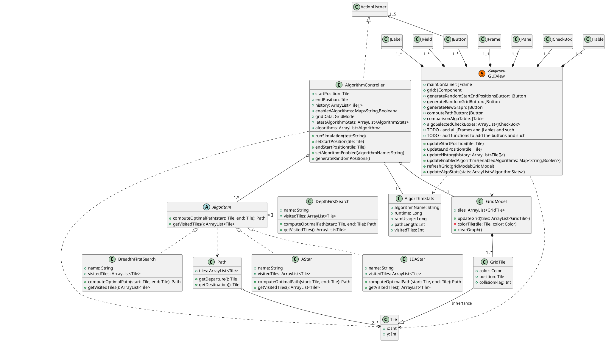
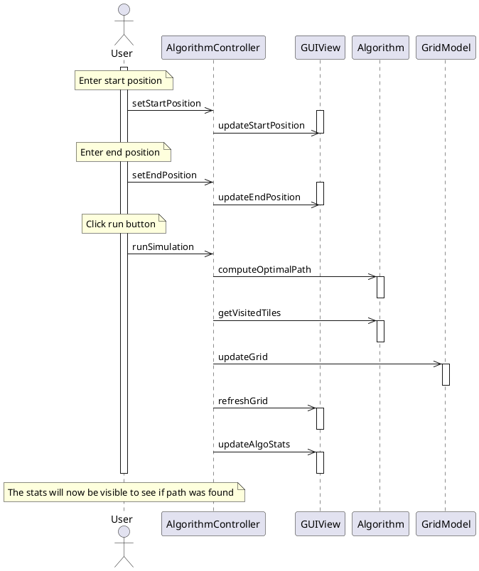
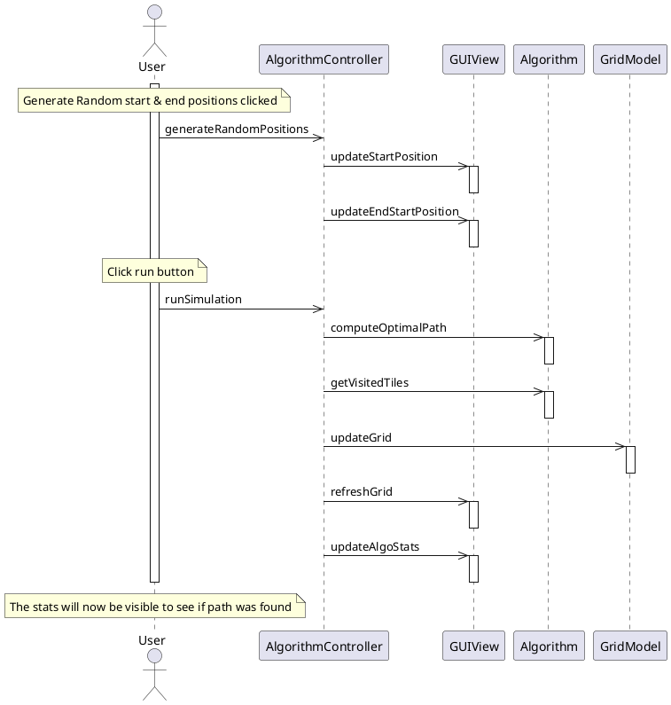
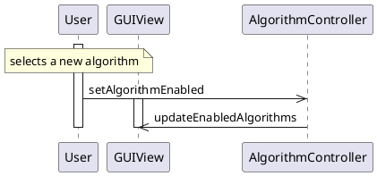
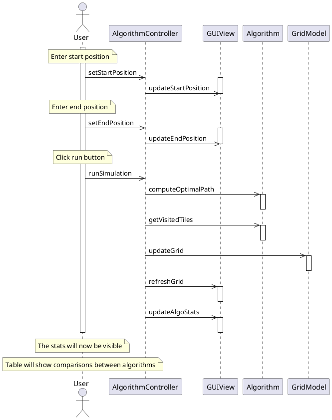
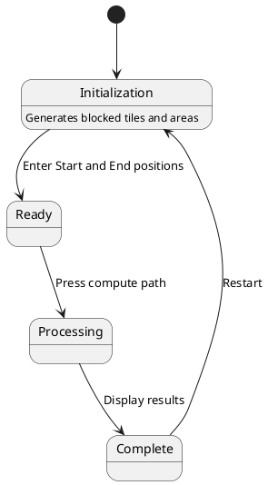
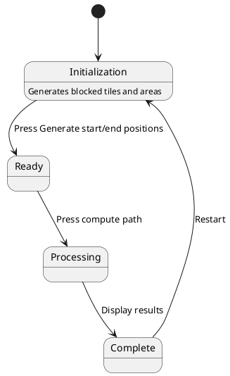
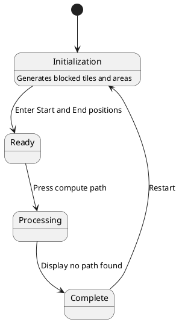

# Path Finding Algorithm Analysis, Spring 2020 
## Group 2 - Object Oriented Software Design
## Adam Corbin - March 2020

# Functional Specification  
# Description
This application will dive into the different types of path finding algorithms games use in order to come up with the generated path when a character or player selects a destination position. This project will have a visual progression of the algorithms so that a human can see how well they preform between each other. I would like to evaluate different situations to find positives and negatives between the algorithms such as best case and worst-case scenarios. Statistic analysis will also be done to evaluate how well they rank between each other.

## List of things that this program will do
- Visual graph representing at least 1 or more algorithms running over time
- A way to view the results between the different algorithm
- A way for a human to pick start and destination points.
- A way to auto pick start and destination points

This will run on Windows 10 OS using Swing

## Intended users
- Any game developers who want to consider different options for path finding.
- Anyone who wants to understand how path finding algorithms work.
# Application Requirements

### Functional Requirements

1. **F.R-1**: The system shall generate a path given a start point, and end point, and the selected algorithm
2. **F.R-2**: The system shall let the user know if a path is not possible to be created
3. **F.R-3**: The system shall have the ability to clear the current paths 
4. **F.R-4**: The system shall keep track of history of each simulation during a given session
5. **F.R-5**: The system shall have the ability to select 2 points from the history
6. **F.R-6**: The system shall provide statistics on the different algorithms
7. **F.R-7**: The system shall provide the recommended algorithm for the given simulation
8. **F.R-8**: The system shall find worst case scenario for each algorithm given the scenario

### UI Requirements

1. **UI.R-1**: The UI shall be able to select a starting point and an end point
2. **UI.R-2**: The UI shall have a button to start the simulation
3. **UI.R-3**: The UI shall be able to see the algorithms behave over time where a human can visually see
4. **UI.R-4**: The UI shall be able to see multiple algorithms running at the same time to see the differences
5. **UI.R-5**: The UI shall have the ability to auto pick the 2 points
6. **UI.R-6**: The UI shall have the ability to select which algorithms to use for the simulation

## Use Cases

### UC-1: User selects a  path
1. The user selects the start and end points and uses default algorithm
2. The system computes the path generation
3. The system displays a successful path

### UC-2: User selects a path

#### Variation #1:  Invalid path
1. After step 2 , the system displays the path could not be found 

### UC-3: Computer generates path 
1. The user selects for the system to pick 2 random points on the graph
2. The system picks 2 random points
3. The system computes the path generation
4. The system displays a successful path

### UC-4: Computer generates path 

#### Variation #1: Invalid path
1. After step 2, the system displays that the path could not be found

### UC-5: User selects a different algorithm
1. The user selects the start and end points
2. The user changes the default algorithm to another selection
3. The system computes the path generation
4. The system displays the successful path 

### User selects points from history
1. The user picks from this history list to switch back to
2. The system regenerates the path from the history
3. The system displays the generated path 

### UC-6: System populates algorithm comparator  
1. The user selects all the algorithms to run for the simulation
2. The user picks the 2 points
3. The system generates the paths for each algorithm
4. The system displays a ranking order between each algorithm with some statistics. 

## Use Cases updated after GUI elements

### UC-1: User selects a  path
1. The user enters the coordinates in the start position text field and end position text filed
1. The user checks the first algorithm JCheckBox
1. The user presses the Compute Path buttons
1. The system computes the path generation
1. The system displays a successful path on the grid JPane

### UC-2: User selects a path

#### Variation #1:  Invalid path
1. After step 2 , the system displays the path could not be found 

### UC-3: Computer generates path 
1. The user presses the generate start and end point button
1. The system picks 2 random points and fills in the start and end JTextField with the positions
1. The user presses the Compute Path buttons
1. The system computes the path generation
1. The system displays a successful path on the grid JPane

### UC-4: Computer generates path 

#### Variation #1: Invalid path
1. After step 2, the system displays that the path could not be found

### UC-5: User selects a different algorithm
1. The user enters the coordinates in the start position text field and end position text filed
1. The user checks the a different algorithm JCheckBox than the first
1. The user presses the Compute Path buttons
1. The system computes the path generation
1. The system displays a successful path on the grid JPane

### User selects points from history
1. The user clicks on a row in the JTable in the historyTable
1. The system will repopulate the start and end points in the JTextFields
1. The system displays the generated path in the grid JPane

### UC-6: System populates algorithm comparator  
1. The user selects all JCheckBox for the algorithms to run for the simulation
1. The user enters the coordinates in the start position text field and end position text filed
1. The user presses the Compute Path buttons
1. The system generates the paths for each algorithm
1. The system displays a ranking order between each algorithm with some statistics in the algorithm results JTable

### UC-7: Generate New Graph
1. The user presses the New Graph button
1. the system will clear the graph JPanel
1. the system will then repopulate GridModel blocking elements
1. The system will then repaint the graph JPanel

# User Interface

## Mockup

Link: https://gomockingbird.com/projects/v95sylo/4gXVnC

# Design Specification 

## CRC cards

### Tile
- Responsibilities
	- Coordinate on a map that is used to represent a node or a position
- Collaborators
	- Path
	
### Path
- Responsibilities
	- An ordered list of tiles that will be used to represent chain of tiles to get from start to finish
- Collaborators
	- Tile
	- Algorithm
	- AlgorithmController
	
### Algorithm 
- Responsibilities
	- Steps to find a path between a departure and destination position
- Collaborators
	- AlgorithmController
	- Path
	
### Grid 
- Responsibilities
	- Showing start and end tiles of a path
	- showing the different paths for the algorithms
	- Showing the visited tiles of the algorithms
- Collaborators
	- GUIView
	- Path
	- Tile
	
### GridTile
- Responsibilities
	- Keeping track of what colors should the tile display in the grid
	- collision flag of the tile
- Collaborators
	- Grid

### AlgorithmController
- Responsibilities
	- Keeping track which algorithms are selected
	- Running the simulations
	- Keeps track of past history of the departure and destination tiles
	- Simulator that runs the algorithms and collects the comparative results
	- Keeps track of the tiles visited while going through the algorithm
	- Keeps track of optimized path for each algorithm 
- Collaborators
	- GUIView
	- Grid
	- Algorithm
	
### GUIView 
- Responsibilities
	- Displaying the grid
	- Displaying the start and end positions
	- Selectable algorithms
	- Displaying the comparison results of the different algorithms
	- Selectable history of past start and end positions	
- Collaborators
	- AlgorithmController
	
## UML Diagrams

### Class diagrams

Examples: https://i.imgur.com/ZjBaYwR.png

# Notes
1. DONE - Algo to algo controller using -<>
1. results should be multiple itterations and add some stastices with standard deviation
1. DONE -Remove color
1. 1 controller for each button. Use a note for the number action listners
1. jbuttons should link up to the action listner
1. DONE - Use Jcomponent for Drawing
1. Path use implement itterable for the tiles
1. DONE - GUIView as a singleton
1. I think DONE - Observer pattern for the Algorithems



### Sequence Diagrams

#### Path found



#### Computer generated path found


#### Selecting different Algorithm


#### Compare algorithms



### State Diagrams

#### Path Found


#### Computer Generated Path found



#### Path not found found



#### Generate new Graph

```plantuml
@startuml
[*] --> Initialization
Initialization : Generates blocked tiles and areas
Initialization --> Ready : Press generate new graph
Ready --> Initialization 
@enduml

# Glossary

- **Path Algorithm** - A set of instructions to iterate over the points to find a way from point A to point B
- **Start, departure point** - the first node in the path
- **End, destination point** - the last node in the path
- **Node, Tile, Point** - Each term here represents an coordinate in a 2 dimensional graph. They will be used in a group to represent a path
- **Path** - a group of nodes,tiles,points that make up an array of elements used describe how to get from point A to point B
- **Results** - a comparison between multiple algorithms
- **History** - A list of start and end points that were chosen by the user or generated by the computer

